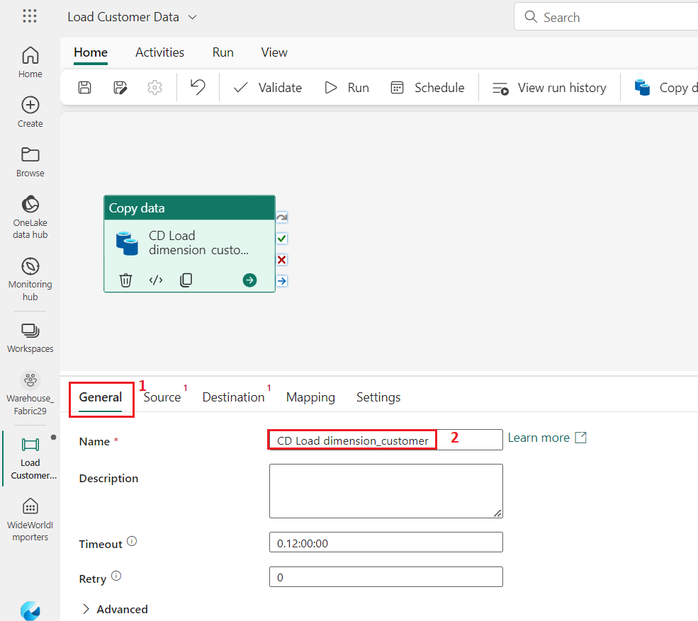
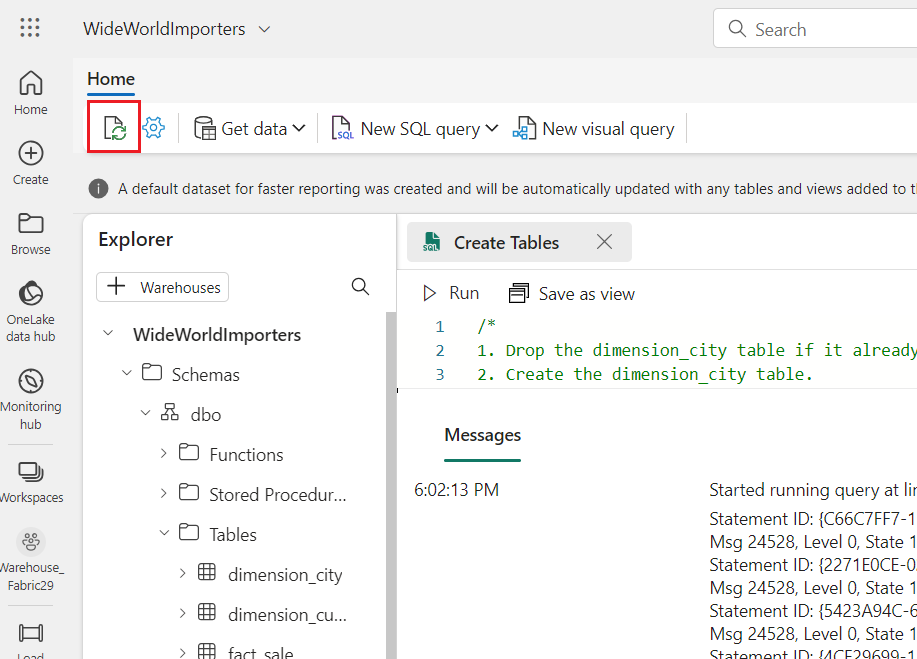
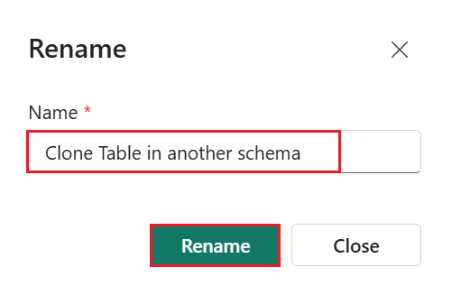
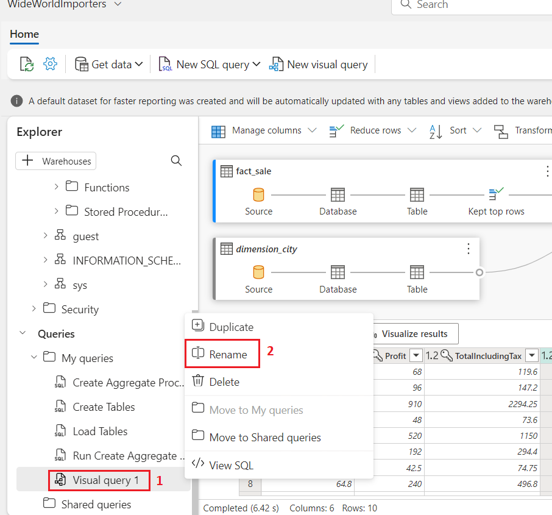
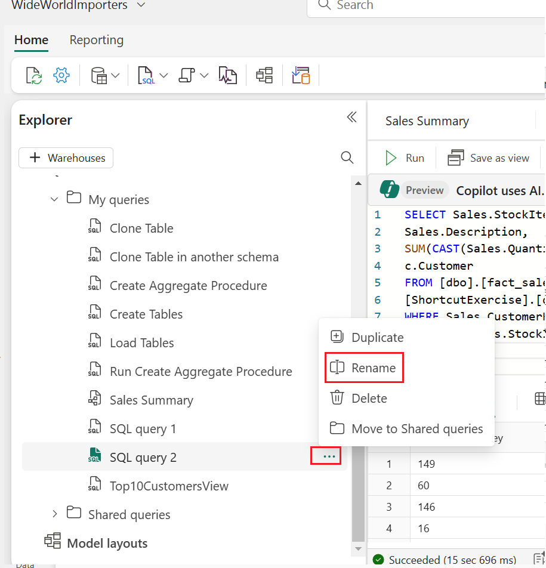

# **Use case 01-Building a Sales and Geography Data Warehouse for Contoso in Microsoft Fabric**
**Introduction**

Contoso, a multinational retail company, is looking to modernize its
data infrastructure to improve sales and geographical analysis.
Currently, their sales and customer data is scattered across multiple
systems, making it difficult for their business analysts and citizen
developers to derive insights. The company plans to consolidate this
data into a unified platform using Microsoft Fabric to enable
cross-querying, sales analysis, and geographical reporting.

In this lab, you’ll assume the role of a data engineer at Contoso tasked
with designing and implementing a data warehouse solution using
Microsoft Fabric. You will start by setting up a Fabric workspace,
creating a data warehouse, loading data from Azure Blob Storage, and
performing analytical tasks to deliver insights to Contoso's
decision-makers.

While many concepts in Microsoft Fabric may be familiar to data and
analytics professionals, it can be challenging to apply those concepts
in a new environment. This lab has been designed to walk step-by-step
through an end-to-end scenario from data acquisition to data consumption
to build a basic understanding of the Microsoft Fabric user experience,
the various experiences and their integration points, and the Microsoft
Fabric professional and citizen developer experiences.

**Objectives**

  - Set up a Fabric workspace with trial enabled.

  - Establish a new Warehouse named WideWorldImporters in Microsoft
    Fabric.

  - Load data into the Warehouse\_FabricXX workspace using a Data
    Factory pipeline.

  - Generate dimension\_city and fact\_sale tables within the data
    warehouse.

  - Populate dimension\_city and fact\_sale tables with data from Azure
    Blob Storage.

  - Create clones of dimension\_city and fact\_sale tables in the
    Warehouse.

  - Clone dimension\_city and fact\_sale tables into the dbo1 schema.

  - Develop a stored procedure to transform data and create
    aggregate\_sale\_by\_date\_city table.

  - Generate a query using the visual query builder to merge and
    aggregate data.

  - Use a notebook to query and analyze data from the
    dimension\_customer table.

  - Include WideWorldImporters and ShortcutExercise warehouses for
    cross-querying.

  - Execute a T-SQL query across WideWorldImporters and ShortcutExercise
    warehouses.

  - Enable Azure Maps visual integration in the Admin portal.

  - Generate column chart, map, and table visuals for Sales Analysis
    report.

  - Create a report using data from the WideWorldImporters dataset in
    the OneLake data hub.

  - Remove the workspace and its associated
items.

# **Exercise 1:** Create a Microsoft Fabric workspace

## **Task 1: Sign in to Power BI account and sign up for the free [Microsoft Fabric trial](https://learn.microsoft.com/en-us/fabric/get-started/fabric-trial)**

1. Open your browser, navigate to the address bar, and type or paste
    the following URL: +++https://app.fabric.microsoft.com/+++ then press the
    **Enter** button.

     

2.  In the **Microsoft Fabric** window, enter assigned credentials, and
    click on the **Submit** button.

    

3.  Then, In the **Microsoft** window enter the password and click on
    the **Sign in** button**.

    

4.  In **Stay signed in?** window, click on the **Yes** button.

    

5.  You’ll be directed to Power BI Home page.

    

## **Task 2: Start the Microsoft Fabric trial**

Follow these steps to start your Fabric trial.

1.  On **Power BI Home** page, click on the **Account manager** on the
    right side. In the Account manager blade, navigate and
    select **Start trial as shown in the below image.**

    

2.  If prompted, agree to the terms and then select **Activate**.

    

3.  Once your trial capacity is ready, you receive a confirmation
    message. Select **Fabric Home Page** to begin working in Fabric.

    

4.  Open your Account manager again. Notice that you now have a heading
    for **Trial status**. Your Account manager keeps track of the number
    of days remaining in your trial. You will also see the countdown in
    your Fabric menu bar when you work in a product experience.

    

## Task 3: Create a workspace

Before working with data in Fabric, create a workspace with the Fabric
trial enabled.

1.  On the **Microsoft Fabric** home page, select the **Power BI**
    template.

    

2.  In the **Power BI Home** page menu bar on the left,
    select **Workspaces** (the icon looks similar to 🗇).

    

3.  In the Workspaces pane Select **+** **New workspace**.
       [](./media/image12.png)
     

4.  In the **Create a workspace tab**, enter the following details and
    click on the **Apply** button.

    |     |    |
    |-------|------|
    |Name	| +++Warehouse_FabricXX+++ (XX can be a unique number) (here, we entered Warehouse_Fabric29)|
    |Description|	This workspace contains all the artifacts for the data warehouse|
    |Advanced|	Under License mode, select Trial|
    |Default| storage format	Small dataset storage format|

       

       

       

5.  Wait for the deployment to complete. It takes 2-3 minutes to
    complete. When your new workspace opens, it should be empty.

      

6.  In the **Power BI Fabric Lakehouse Tutorial-XX** page, click on the
    **Data Warehouse** icon located at the bottom left and select **Data
    Warehouse** under Datascience.

     

## Task 4: Create a Warehouse in Microsoft Fabric

1.  In the **Synapse** **Data Warehouse** page, select **Warehouse** to
    create a lakehouse.

     

2.  On the **New warehouse** dialog,enter +++WideWorldImporters+++ and click on the **Create**
    button.

     

3.  When provisioning is complete, the **WideWorldImporters**
    warehouse landing page appears.

    

# Exercise 2: Ingest data into a Warehouse in Microsoft Fabric

## Task 1: Ingest data into a Warehouse

1.  From the **WideWorldImporters** warehouse landing page,
    select **Warehouse\_FabricXX** in the left-sided navigation menu to
    return to the workspace item list.
      
          
2.  In the **Warehouse\_FabricXX** page, select **+New item**. Then,
    click Data pipeline to view the full list of available items under
    Get data.
     

3.  On the **New pipeline** dialog box, in the **Name** field, enter
    +++Load Customer Data+++ and click on the **Create** button.
    
      

5.  In the **Load Customer Data** page, navigate to **Start building
    your data pipeline** section and click on **Pipeline activity**.
    
     

6.  Navigate and select **Copy data** under **Move
    &transform** section.

    

7.  Select the newly created **Copy data 1** activity from the
    design canvas to configure it.
    **Note**: Drag the horizonal line in the design canvas to have a
     complete view of various features.
    
      

8.  On the **General** tab, in the **Name** field, enter +++CD Load dimension_customer+++ .

     

9.  On the **Source** page, select the **Connection** dropdown.
    Select **More** to see all of the data sources you can choose from,
    including data sources in your local OneLake data hub.

     

10.  On the **Get data** window, search **Azure Blob Storage** in, then
    click on the **Azure Blob Storage** button.

      

11. On the **Connection settings** pane that appears on the right side,
    configure the following settings and click on the **Create** button.

      a)	In the Account name or URL, enter +++https://fabrictutorialdata.blob.core.windows.net/sampledata/+++

    
      b)	In the Connection credentials section, click on the dropdown under Connection, then select Create new connection.
    
      c)	In Connection name field, enter +++Wide World Importers Public Sample+++.
    
      d)  Set the Authentication kind to **Anonymous**.
         

13. Change the remaining settings on the **Source** page of the copy
    activity as follows to reach the .parquet files in   
    https://fabrictutorialdata.blob.core.windows.net/sampledata/WideWorldImportersDW/parquet/full/dimension_customer/*.parquet

14. In the **File path** text boxes, provide:

      a)	Container: **+++sampledata+++**
      b)	File path - Directory: **+++WideWorldImportersDW/tables+++**
      c)	 File path - File name: **+++dimension_customer.parquet+++**
      d)	In the File format drop down, choose Parquet (if you are unable to see Parquet, then type in the search box and 
         then select it)
       

15. Click on **Preview data** on the right side of **File path** setting
    to ensure that there are no errors and then click on **close.**

    

    

16. On the **Destination** tab, enter the following settings.

    |     |    |
    |-------|------|
    |Connection| +++WideWorldImporters+++|
    |Table option|	select the Auto create table radio button.|
    |Data Warehouse|	drop down, select WideWorldImporters from the list|
    |Table|	•	In the first box enter +++dbo+++                                                                                    •	In the second box enter +++dimension_customer+++|

     

17. From the ribbon, select **Run**.

      

18. In the **Save and run?** dialog box, click on **Save and run**
    button.

     
      

      

19. Monitor the copy activity's progress on the **Output** page and wait
    for it to complete.

     

# Exercise 3: Create tables in a Data Warehouse

## Task 1: Create table in a Data Warehouse

1.  On **Load Customer Data** page, click on **Warehouse\_FabricXX**
    workspace in the left-sided navigation bar.

     

2.  In the **Syanapse Data Engineering** **Warehouse\_FabricXX** page,
    carefully navigate and click on **WideWorldImporters** having
    **Warehouse** type as shown in the below
    image.

      

3.  On the **WideWorldImporters** page, go to the **Home** tab, select **SQL** from the drop
    down, and click on **New SQL query**.
    

4.  In the query editor, paste the following code and select **Run** to
    execute the query
      ```
      /*
      1. Drop the dimension_city table if it already exists.
      2. Create the dimension_city table.
      3. Drop the fact_sale table if it already exists.
      4. Create the fact_sale table.
      */
      
      --dimension_city
      DROP TABLE IF EXISTS [dbo].[dimension_city];
      CREATE TABLE [dbo].[dimension_city]
          (
              [CityKey] [int] NULL,
              [WWICityID] [int] NULL,
              [City] [varchar](8000) NULL,
              [StateProvince] [varchar](8000) NULL,
              [Country] [varchar](8000) NULL,
              [Continent] [varchar](8000) NULL,
              [SalesTerritory] [varchar](8000) NULL,
              [Region] [varchar](8000) NULL,
              [Subregion] [varchar](8000) NULL,
              [Location] [varchar](8000) NULL,
              [LatestRecordedPopulation] [bigint] NULL,
              [ValidFrom] [datetime2](6) NULL,
              [ValidTo] [datetime2](6) NULL,
              [LineageKey] [int] NULL
          );
      
      --fact_sale
      
      DROP TABLE IF EXISTS [dbo].[fact_sale];
      
      CREATE TABLE [dbo].[fact_sale]
      
          (
              [SaleKey] [bigint] NULL,
              [CityKey] [int] NULL,
              [CustomerKey] [int] NULL,
              [BillToCustomerKey] [int] NULL,
              [StockItemKey] [int] NULL,
              [InvoiceDateKey] [datetime2](6) NULL,
              [DeliveryDateKey] [datetime2](6) NULL,
              [SalespersonKey] [int] NULL,
              [WWIInvoiceID] [int] NULL,
              [Description] [varchar](8000) NULL,
              [Package] [varchar](8000) NULL,
              [Quantity] [int] NULL,
              [UnitPrice] [decimal](18, 2) NULL,
              [TaxRate] [decimal](18, 3) NULL,
              [TotalExcludingTax] [decimal](29, 2) NULL,
              [TaxAmount] [decimal](38, 6) NULL,
              [Profit] [decimal](18, 2) NULL,
              [TotalIncludingTax] [decimal](38, 6) NULL,
              [TotalDryItems] [int] NULL,
              [TotalChillerItems] [int] NULL,
              [LineageKey] [int] NULL,
              [Month] [int] NULL,
              [Year] [int] NULL,
              [Quarter] [int] NULL
          );
      ```
      
  
      

6.  To save this query, right-click on the **SQL query 1** tab just
    above the editor and select **Rename**.

      

7.  In the **Rename** dialog box, under **Name** field, enter
    **+++Create Tables+++** to change the name of **SQL query 1**. Then,
    click on the **Rename** button.

     

8.  Validate the table was created successfully by selecting the
    **refresh icon** button on the ribbon.

     

9.  In the **Explorer** pane, you’ll see the **fact_sale** table
    and **dimension_city** table.

     

## Task 2: Load data using T-SQL

Now that you know how to build a data warehouse, load a table, and
generate a report, it's time to extend the solution by exploring other
methods for loading
    data.

1. On the WideWorldImporters page, go to the Home tab, select **SQL** from the dropdown, and click on **New SQL query**.

     

2.  In the query editor, **paste** the following code, then click on
    **Run** to execute the query.

     SQLCopy
      ```
      --Copy data from the public Azure storage account to the dbo.dimension_city table.
      COPY INTO [dbo].[dimension_city]
      FROM 
      'https://fabrictutorialdata.blob.core.windows.net/sampledata/WideWorldImportersDW/tables/dimension_city.parquet'
      WITH (FILE_TYPE = 'PARQUET');
      
      --Copy data from the public Azure storage account to the dbo.fact_sale table.
      COPY INTO [dbo].[fact_sale]
      FROM 'https://fabrictutorialdata.blob.core.windows.net/sampledata/WideWorldImportersDW/tables/fact_sale.parquet'
      WITH (FILE_TYPE = 'PARQUET');
      ```
      

3.  After the query is completed, review the messages, which indicats
    the number of rows that were loaded into the **dimension_city** and
    **fact_sale** tables respectively.

    

4.  Load the data preview to validate the data loaded successfully by
    selecting on the **fact_sale** table in the **Explorer**.

    

5.  Rename the query. Right-click on **SQL query 1** in
    the **Explorer**, then select **Rename**.
     

6.  In the **Rename** dialog box, under the **Name** field, enter
    **+++Load Tables+++**. Then, click on **Rename** button.

    

7.  Click on the **Refresh** icon in the command bar below the **Home**
    tab.

    

# **Exercise 4: Clone a table using T-SQL in Microsoft Fabric**

## Task 1: Create a table clone within the same schema in a warehouse

This task guides you through creating a [table
clone](https://learn.microsoft.com/en-in/fabric/data-warehouse/clone-table) in
Warehouse in Microsoft Fabric, using the [CREATE TABLE AS CLONE
OF](https://learn.microsoft.com/en-us/sql/t-sql/statements/create-table-as-clone-of-transact-sql?view=fabric&preserve-view=true) T-SQL
syntax.

1.  Create a table clone within the same schema in a warehouse.

2.  On the WideWorldImporters page, go to the Home tab,select **SQL** from the dropdown, and click on **New SQL query**. 

     

3.  In the query editor, paste the following code to create clones of
    the **dbo.dimension\_city** and **dbo.fact\_sale** tables.
  
       SQLCopy
       ```
      --Create a clone of the dbo.dimension_city table.
      CREATE TABLE [dbo].[dimension_city1] AS CLONE OF [dbo].[dimension_city];
      
      --Create a clone of the dbo.fact_sale table.
      CREATE TABLE [dbo].[fact_sale1] AS CLONE OF [dbo].[fact_sale];
      ```
       

4.  Select **Run** to execute the query. The query takes a few seconds
    to execute. After the query is completed, the table clones
    **dimension_city1** and **fact_sale1** will be created.

     

     

5.  Load the data preview to validate the data loaded successfully by
    selecting on the **dimension_city1** table in the **Explorer**.

     

6.  Right-click on **SQL query** that you’ve created to clone the
    tables in the **Explorer** and select **Rename**.

     

7.  In the **Rename** dialog box, under the **Name** field, enter
    **+++Clone Table+++**, then click on the **Rename** button.

     

8.  Click on the **Refresh** icon in the command bar below the **Home**
    tab.

     

## Task 2: Create a table clone across schemas within the same warehouse

1.  On the **WideWorldImporters** page, go to the **Home** tab, select **SQL** from the dropdown, and click on **New SQL query**. 

     

2.  Create a new schema within the **WideWorldImporter** warehouse
    named **dbo1**. **Copy paste** and **run** the following T-SQL code
    as shown in the below image:

    SQLCopy
    ```
    CREATE SCHEMA dbo1;
    ```
    

    

3.In the **query editor**, remove the existing code and paste the following to create clones of the **dbo.dimension_city ** and **dbo.fact_sale** tables in the dbo1 schema.  

      
       ```
      --Create a clone of the dbo.dimension_city table in the dbo1 schema.
      CREATE TABLE [dbo1].[dimension_city1] AS CLONE OF [dbo].[dimension_city];
      
      --Create a clone of the dbo.fact_sale table in the dbo1 schema.
      CREATE TABLE [dbo1].[fact_sale1] AS CLONE OF [dbo].[fact_sale];
      ```

4.  Select **Run** to execute the query. The query takes a few seconds
    to execute.

     

5.  After the query is completed,
    clones **dimension_city1** and **fact_sale1** are created in
    the **dbo1** schema.

    

6.  Load the data preview to validate the data loaded successfully by
    selecting on the **dimension_city1** table under **dbo1** schema in
    the **Explorer**.

     

7.  **Rename** the query for reference later. Right-click on **SQL query
    1** in the **Explorer** and select **Rename**.

     

8.  In the **Rename** dialog box, under the **Name** field, enter
    +++Clone Table in another schema+++. Then, click on **Rename**
    button.

     

9.  Click on the **Refresh** icon in the command bar below the **Home**
    tab.

     

# Exercise 5: Transform data using a stored procedure

Learn how to create and save a new stored procedure to transform
    data.

1.  On the **WideWorldImporters** page, go to the **Home** tab, select **SQL** from the dropdown, and click on **New SQL query**.

     

2.  In the query editor, **paste** the following code to create the
    stored procedure **dbo.populate_aggregate_sale_by_city**. This
    stored procedure will create and load
    the **dbo.aggregate_sale_by_date_city** table in a later step.
       SQLCopy
       ```
           --Drop the stored procedure if it already exists.
      DROP PROCEDURE IF EXISTS [dbo].[populate_aggregate_sale_by_city]
      GO
      
      --Create the populate_aggregate_sale_by_city stored procedure.
      CREATE PROCEDURE [dbo].[populate_aggregate_sale_by_city]
      AS
      BEGIN
          --If the aggregate table already exists, drop it. Then create the table.
          DROP TABLE IF EXISTS [dbo].[aggregate_sale_by_date_city];
          CREATE TABLE [dbo].[aggregate_sale_by_date_city]
              (
                  [Date] [DATETIME2](6),
                  [City] [VARCHAR](8000),
                  [StateProvince] [VARCHAR](8000),
                  [SalesTerritory] [VARCHAR](8000),
                  [SumOfTotalExcludingTax] [DECIMAL](38,2),
                  [SumOfTaxAmount] [DECIMAL](38,6),
                  [SumOfTotalIncludingTax] [DECIMAL](38,6),
                  [SumOfProfit] [DECIMAL](38,2)
              );
      
          --Reload the aggregated dataset to the table.
          INSERT INTO [dbo].[aggregate_sale_by_date_city]
          SELECT
              FS.[InvoiceDateKey] AS [Date], 
              DC.[City], 
              DC.[StateProvince], 
              DC.[SalesTerritory], 
              SUM(FS.[TotalExcludingTax]) AS [SumOfTotalExcludingTax], 
              SUM(FS.[TaxAmount]) AS [SumOfTaxAmount], 
              SUM(FS.[TotalIncludingTax]) AS [SumOfTotalIncludingTax], 
              SUM(FS.[Profit]) AS [SumOfProfit]
          FROM [dbo].[fact_sale] AS FS
          INNER JOIN [dbo].[dimension_city] AS DC
              ON FS.[CityKey] = DC.[CityKey]
          GROUP BY
              FS.[InvoiceDateKey],
              DC.[City], 
              DC.[StateProvince], 
              DC.[SalesTerritory]
          ORDER BY 
              FS.[InvoiceDateKey], 
              DC.[StateProvince], 
              DC.[City];
      END
      ```
  
     
  
     

3.  Right-click on SQL query that you’ve created to clone the tables in
    the Explorer and select **Rename**.

    

4.  In the **Rename** dialog box, under the **Name** field, enter
    +++Create Aggregate Procedure+++, then click on the **Rename**
    button.

     

5.  Click on the **Refresh icon** below the **Home** tab.

     

6.  In the **Explorer** tab, verify that you can see the newly created
    stored procedure by expanding the **StoredProcedures** node under
    the **dbo** schema.

     

7.  On the **WideWorldImporters** page, go to the **Home** tab, select **SQL** from the dropdown, and click on **New SQL query**.

      

8.  In the query editor, paste the following code. This T-SQL executes
    **dbo.populate_aggregate_sale_by_city** to create the
    **dbo.aggregate_sale_by_date_city** table.Run the query

      SQLCopy
      ```
      --Execute the stored procedure to create the aggregate table.
      EXEC [dbo].[populate_aggregate_sale_by_city];
      ```
     

9.  To save this query for reference later, right-click on the query tab
    just above the editor and select **Rename.**
    
    

10. In the **Rename** dialog box, under the **Name** field, enter
   **+++Run Create Aggregate Procedure+++**, then click on the
    **Rename** button.
    
    

11. Select the **Refresh** icon on the ribbon.
    
    

12. In the Object **Explorer** tab, load the data preview to validate
    the data loaded successfully by selecting on
    the **aggregate_sale_by_city** table in
    the **Explorer**.
    
    

# Exercise 6: Time travel using T-SQL at statement level

1.  On the **WideWorldImporters** page, go to the **Home** tab, select **SQL** from the dropdown, and click on **New SQL query**.

     

2.  In the query editor, paste the following code to create the
    view Top10CustomerView. Select **Run** to execute the query.

    ```    
       CREATE VIEW dbo.Top10CustomersView
    AS
    SELECT TOP (10)
        FS.[CustomerKey],
        DC.[Customer],
        SUM(FS.TotalIncludingTax) AS TotalSalesAmount
    FROM
        [dbo].[dimension_customer] AS DC
    INNER JOIN
        [dbo].[fact_sale] AS FS ON DC.[CustomerKey] = FS.[CustomerKey]
    GROUP BY
        FS.[CustomerKey],
        DC.[Customer]
    ORDER BY
        TotalSalesAmount DESC;
    ```
    
    

3.  In the **Explorer**, verify that you can see the newly created
    view **Top10CustomersView** by expanding the **View** node
    under dbo schema.
    
    

4.  To save this query for reference later, right-click on the query tab
    just above the editor and select **Rename.**
    
    

5.  In the **Rename** dialog box, under the **Name** field, enter 
    **+++Top10CustomersView+++**, then click on the **Rename** button.
    
     

6.  Create another new query, similar to Step 1. From the **Home** tab
    of the ribbon, select **New SQL query**.
    
    

7.  In the query editor, paste the following code. This updates
    the **TotalIncludingTax** column value to **200000000** for the
    record which has the **SaleKey **value of **22632918.**
    Select **Run** to execute the query.
    
    SQLCopy
      ```
      /*Update the TotalIncludingTax value of the record with SaleKey value of 22632918*/
      UPDATE [dbo].[fact_sale]
      SET TotalIncludingTax = 200000000
      WHERE SaleKey = 22632918;
      ```
    
     

8.  In the query editor, paste the following code.
    The CURRENT\_TIMESTAMP T-SQL function returns the current UTC
    timestamp as a **datetime**. Select **Run** to execute the query.
    
      SQLCopy
      ```
      SELECT CURRENT_TIMESTAMP;
      ```
      

9.  Copy the timestamp value returned to your clipboard.
      

10. Paste the following code in the query editor and replace the
    timestamp value with the current timestamp value obtained from the
    prior step. The timestamp syntax format
    is **YYYY-MM-DDTHH:MM:SS[.FFF]**

11. Remove the trailing zeroes, for
    example: **2024-04-24T20:59:06.097**.

12. The following example returns the list of top ten customers
    by **TotalIncludingTax**, including the new value
    for **SaleKey** 22632918. Replace the existing code and paste the
    following code and select **Run** to execute the query.
    
    SQLCopy
    ```
   /*View of Top10 Customers as of today after record updates*/
    SELECT *
    FROM [WideWorldImporters].[dbo].[Top10CustomersView]
    OPTION (FOR TIMESTAMP AS OF '2024-04-24T20:59:06.097');
    ```

   

14. Paste the following code in the query editor and replace the
    timestamp value to a time prior to executing the update script to
    update the **TotalIncludingTax** value. This would return the list
    of top ten customers *before* the **TotalIncludingTax** was updated
    for **SaleKey** 22632918. Select **Run** to execute the query.
    
    SQLCopy
    ```
    /\*View of Top10 Customers as of today before record updates\*/
    
    SELECT \*
    
    FROM \[WideWorldImporters\].\[dbo\].\[Top10CustomersView\]
    
    OPTION (FOR TIMESTAMP AS OF '2024-04-24T20:49:06.097');
    ```
    

# Exercise 7: Create a query with the visual query builder

## Task 1: Use the visual query builder

Create and save a query with the visual query builder in the Microsoft
Fabric portal.

1.  In the **WideWolrdImporters** page, from the **Home** tab of the
    ribbon, select **New visual query**.

     

2.  Right-click on **fact\_sale** and select **Insert into canvas**

     
    
     

3.  Navigate to query design pane **transformations ribbon** and limit
    the dataset size by clicking on **Reduce rows** dropdown, then click
    on **Keep top rows** as shown in the below image.

    

4.  In the **Keep top rows** dialog box, enter **+++10000+++** and
    Select **OK**.

     
 
    

5.  Right-click on **dimension\_city**  and select **Insert into
    canvas**

    

     

6.  From the transformations ribbon, select the dropdown beside
    **Combine** and select **Merge queries as new** as shown in the
    below image.

    

7.  On the **Merge** settings page enter the following details.

    a)	In the **Left table for merge** dropdown, choose **dimension_city**
    
    b)	In the **Right table for merge** dropdown, choose **fact_sale** (use horizontal and vertical scroll bar)
    
    c)	Select the **CityKey** field in the **dimension_city** table by selecting on the column name in the header row to indicate the join column.
    
    d)	Select the **CityKey** field in the fact_sale table by selecting on the column name in the header row to indicate the join column.
    
    e)	In the **Join kind** diagram selection, choose Inner and click on the **Ok** button.

      
      
      

9.  With the **Merge** step selected, select the **Expand** button
    beside **fact_sale** on the header of the data grid as shown in the
    below image, then select the columns **TaxAmount, Profit,
    TotalIncludingTax** and select **Ok.**

      
      
      

10.  In the **transformations ribbon,** click on the dropdown beside
    **Transform**, then select **Group by**.

      

11. On the **Group by** settings page, enter the following details.

     a)	Select **Advanced** radio button.
     b)	Under **Group by** select the following: 
      i.	**Country**
      ii.	**StateProvince**
      iii.	**City**
     c)	In the **New column name**, enter **SumOfTaxAmount** In **Operation** colum field, select **Sum**, then under Column field, select **TaxAmount**. Click on **Add aggregation** to add more aggregate column and operation.
      
      d) In the **New column name** , enter **SumOfProfit** In **Operation** colum field, select **Sum**, then under Column field, select **Profit**. Click on **Add aggregation** to add more aggregate column and operation.
      
      e)	In the **New column name**, enter **SumOfTotalIncludingTax** In **Operation** colum field, select **Sum**, then under Column field, **TotalIncludingTax**. 
      f)	Click on the **OK** button	
        
        

11. In the explorer, navigate to **Queries** and right-click on **Visual
    query 1** under **Queries**. Then, select **Rename**.

     

12. Type **+++Sales Summary+++** to change the name of the query.
    Press **Enter** on the keyboard or select anywhere outside the tab
    to save the change.

     

13. Click on the **Refresh** icon below the **Home** tab.

     

# Exercise 8: Analyze data with a notebook

## Task 1: Create a lakehouse shortcut and analyze data with an notebook

In this task, learn about how you can save your data once and then use
it with many other services. Shortcuts can also be created to data
stored in Azure Data Lake Storage and S3 to enable you to directly
access delta tables from external systems.

First, we create a new lakehouse. To create a new lakehouse in your
Microsoft Fabric workspace:

1.  On the **WideWorldImportes** page, click on **Warehouse_FabricXX**
    Workspace on the left-sided navigation
    menu.

      

2.  On the **Synapse Data Engineering Warehouse\_FabricXX** home page, under the **Warehouse\_FabricXX** pane, click **+New item**, and then select **Lakehouse **under **Stored data**

     

3.  In the **Name** field, enter **+++ShortcutExercise+++** and click on
    the **Create** button.

     

4.  The new lakehouse loads and the **Explorer** view opens up, with
    the **Get data in your lakehouse** menu. Under **Load data in your
    lakehouse**, select the **New shortcut** button.

     

5.  In the **New shortcut** window, select **Microsoft OneLake**.

     

6.  In the **Select a data source type** window, carefully navigate and
    click on the **Warehouse** named **WideWorldImporters** that you’ve
    created previously, then click on the **Next** button**.**

     

7.  In the **OneLake** object browser, expand **Tables**, then expand
    the **dbo** schema, and select the radio button
    beside **dimension\_customer**. Select the **Next** button.

     

8.  In the **New shortcut** window, click on the **Create** button and
    click on the **Close** button

     
   
      

9.  Wait for a while and then click on the **Refresh** icon.

10. Then, select the **dimension_customer** in the **Table** list to
    preview the data. Notice that the lakehouse is showing the data from
    the **dimension_customer** table from the Warehouse.

     

11. Next, create a new notebook to query
    the **dimension_customer** table. In the **Home** ribbon, select
    the drop down for **Open notebook** and choose **New notebook**.

      

12. Select, then drag the **dimension_customer** from
    the **Tables** list into the open notebook cell. You can see a
    **PySpark** query has been written for you to query all the data
    from **ShortcutExercise.dimension_customer**. This notebook
    experience is similar to Visual Studio Code Jupyter notebook
    experience. You can also open the notebook in VS Code.

     

13. In the **Home** ribbon, select the **Run all** button. Once the
    query is completed, you will see you can easily use PySpark to query
    the Warehouse tables\!

     

# Exercise 9:Create cross-warehouse queries with the SQL query editor

## Task 1: Add multiple warehouses to the Explorer

In this task, learn about how you can easily create and execute T-SQL
queries with the SQL query editor across multiple warehouse, including
joining together data from a SQL Endpoint and a Warehouse in Microsoft
Fabric.

1.  From **Notebook1** page, navigate and click on
    **Warehouse_FabricXX** Workspace on the left-sided navigation menu.

     

2.  In the **Warehouse_FabricXX** view, select
    the **WideWorldImporters** warehouse.

     

3.  In the **WideWorldImporters** page, under **Explorer** tab, select
    the **+ Warehouses** button.

      

4.  In Add warehouses window, select **ShortcutExercise** and click on
    the **Confirm** button. Both warehouse experiences are added to the
    query.

    

5.  Your selected warehouses now show the same **Explorer** pane.
    
    

## Task 2: Execute a cross-warehouse query

In this example, you can see how easily you can run T-SQL queries across
the WideWorldImporters warehouse and ShortcutExercise SQL Endpoint. You
can write cross-database queries using three-part naming to reference
the database.schema.table, as in SQL Server.

1.  From the **Home** tab of the ribbon, select **New SQL query**.

    

2.  In the query editor, copy and paste the following T-SQL code. Select
    the **Run** button to execute the query. After the query is
    completed, you will see the results.
      ```
      SELECT Sales.StockItemKey, 
      Sales.Description, 
      SUM(CAST(Sales.Quantity AS int)) AS SoldQuantity, 
      c.Customer
      FROM [dbo].[fact_sale] AS Sales,
      [ShortcutExercise].[dbo].[dimension_customer] AS c
      WHERE Sales.CustomerKey = c.CustomerKey
      GROUP BY Sales.StockItemKey, Sales.Description, c.Customer;
      ```
      
      

3.  Rename the query for reference. Right-click on **SQL query** in the
    **Explorer** and select **Rename**.

    

4.  In the **Rename** dialog box, under the **Name** field, enter
    **+++Cross-warehouse query+++**, then click on the **Rename**
    button. 

     

# Exercise 10: Create Power BI reports

## Task 1: Create Power BI reports

In this task we learn how to create and save several types of Power BI
reports.

1.  In the **WideWorldImportes** page, under the **Home** tab, select
    the **Model** view .

     

2.  From the **fact_sale** table, drag the **CityKey** field and drop
    it onto the **CityKey** field in the **dimension_city** table to
    create a relationship.

    

3.  On the **Create Relationship** settings:


      - **Table 1** is populated with **fact_sale** and the column
        of **CityKey**.
    
      - **Table 2** is populated with **dimension_city** and the column
        of **CityKey**.
    
      - **Cardinality**: select **Many to one (*:1)**.
    
      - **Cross filter direction**: select **Single**.
    
      - Check the box for **Make this relationship active**.
    
      - Select **Save**.
  
      
      
      

4.  From the **Reporting** tab of the ribbon, select **New report**.

     
     
     

5.  In the **Synapse Data Engineering Warehouse_FabricXX** page,
    under **Visualizations**, click to the **Column chart** icon to add
    a **Column chart** to your report.

    

      - On the **Data** pane, expand **fact_sales** and check the box next
        to **Profit**. This creates a column chart and adds the field to the
        Y-axis.
    
      - On the **Data** pane, expand **dimension_city** and check the box
        next to **SalesTerritory**. This adds the field to the X-axis.
    
      - Reposition and resize the column chart to take up the top left
        quarter of the canvas by dragging the anchor points on the corners
        of the visual.

      
      
      
      
      

6.  Select anywhere on the blank canvas (or press the Esc key) so the
    column chart visual is no longer selected.

7. Build a **Table** visual on the **Visualizations** pane, select
    the **Table** visual.

     

8. From the **Data** pane, check the box next to **SalesTerritory** on
    the **dimension_city** table.

9. From the **Data** pane, check the box next to **StateProvince** on
    the **dimension_city** table.

     

10. From the **Data** pane, check the box next to **Profit** on
    the **fact_sale** table.

11. From the **Data** pane, check the box next
    to **TotalExcludingTax** on the **fact_sale** table.

    

12. Reposition and resize the column chart to take up the right half of
    the canvas by dragging the anchor points on the corners of the
    visual.

    

13. In the Synapse Data Engineering Warehouse_FabricXX page, from the
    ribbon, select **File** and select the **Save**.

      

14. In the Save your report dialog box, enter **+++Sales Analysis+++**
    as the name of your report and click on the **Save** button.

      

15. You will see a notification stating **Report saved.**

    

## Task 3: Build a report from the OneLake data hub

Learn how to build a report with the data you ingested into your
Warehouse in the last step.

1.  In the **Sales Analysis** pane, select the **OneLake data hub** in
    the left navigation menu.

     

2.  From the item list, select **WideWorldImporters** with the type
    of **Dataset (default)**.

    

3.  In the **Visualize this data** section, select **Create a
    report** and select **Auto-create**. A report is generated from
    the **dimension_customer** table that was loaded in the previous
    section.

     

4.  A report similar to the following image is generated.

     

5.  From the ribbon, select **Save**.

     

6.  In the **Save your report** dialog box, enter **+++Customer Quick
    Summary+++** in the name box. In the **Save your report** dialogue,
    select **Save**.

     

7.  You will see a notification stating **Report saved.**

     
 
     

## Task 4: Clean up resources

You can delete individual reports, pipelines, warehouses, and other
items or remove the entire workspace. In this tutorial, you will clean
up the workspace, individual reports, pipelines, warehouses, and other
items you created as part of the lab.

1.  Select **Warehouse_FabricXX** in the navigation menu to return to
    the workspace item list.

     

2.  In the menu of the workspace header, select **Workspace settings**.

      

3.  In the **Workspace settings** dialog box, select **Other** and
    select the **Remove this workspace**.

      

4.  In the **Delete workspace?** dialog box, click on the **Delete**
    button.
    
**Summary**

This comprehensive lab walks through a series of tasks aimed at
establishing a functional data environment in Microsoft Fabric. It
starts with the creation of a workspace, essential for data operations,
and ensures the trial is enabled. Subsequently, a Warehouse named
WideWorldImporters is established within the Fabric environment to serve
as the central repository for data storage and processing. Data
ingestion into the Warehouse\_FabricXX workspace is then detailed
through the implementation of a Data Factory pipeline. This process
involves fetching data from external sources and integrating it
seamlessly into the workspace. Critical tables, dimension\_city, and
fact\_sale, are created within the data warehouse to serve as
foundational structures for data analysis. The data loading process
continues with the use of T-SQL, where data from Azure Blob Storage is
transferred into the specified tables. The subsequent tasks delve into
the realm of data management and manipulation. Cloning tables is
demonstrated, offering a valuable technique for data replication and
testing purposes. Additionally, the cloning process is extended to a
different schema (dbo1) within the same warehouse, showcasing a
structured approach to data organization. The lab progresses to data
transformation, introducing the creation of a stored procedure to
efficiently aggregate sales data. It then transitions to visual query
building, providing an intuitive interface for complex data queries.
This is followed by an exploration of notebooks, demonstrating their
utility in querying and analyzing data from the dimension\_customer
table. Multi-warehouse querying capabilities are then unveiled, allowing
for seamless data retrieval across various warehouses within the
workspace. The lab culminates in enabling Azure Maps visuals
integration, enhancing geographical data representation in Power BI.
Subsequently, a range of Power BI reports, including column charts,
maps, and tables, are created to facilitate in-depth sales data
analysis. The final task focuses on generating a report from the OneLake
data hub, further emphasizing the versatility of data sources in Fabric.
Finally, the lab provides insights into resource management, emphasizing
the importance of cleanup procedures to maintain an efficient workspace.
Collectively, these tasks present a comprehensive understanding of
setting up, managing, and analyzing data within Microsoft Fabric.
