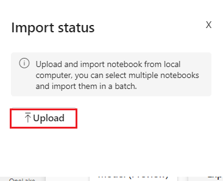
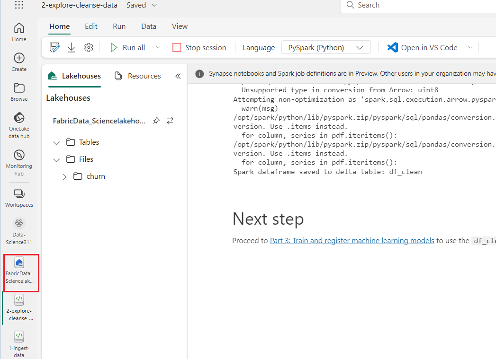
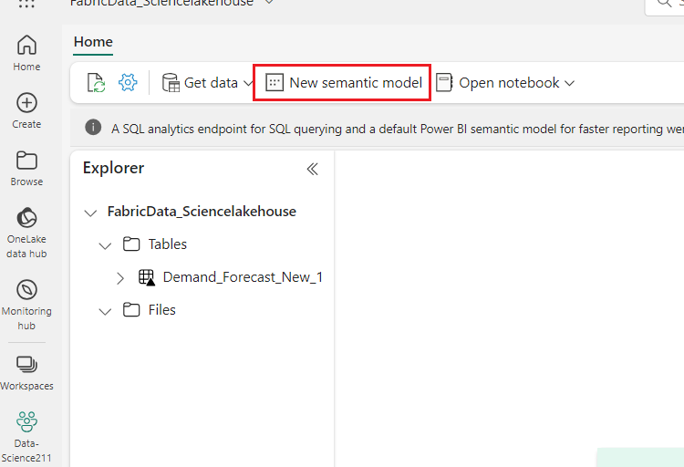

# **Use Case 02- Implementing a Data Science scenario in Microsoft Fabric** 
**Introduction**

The lifecycle of a Data science project typically includes (often,
iteratively) the following steps:

- Business understanding

- Data acquisition

- Data exploration, cleansing, preparation, and visualization

- Model training and experiment tracking

- Model scoring and generating insights.

The goals and success criteria of each stage depend on collaboration,
data sharing and documentation. The Fabric data science experience
consists of multiple native-built features that enable collaboration,
data acquisition, sharing, and consumption in a seamless way.

In these tutorials, you take the role of a data scientist who has been
given the task to explore, clean, and transform a dataset containing the
churn status of 10000 customers at a bank. You then build a machine
learning model to predict which bank customers are likely to leave.

**Objective**

1.  Use the Fabric notebooks for data science scenarios.

2.  Ingest data into a Fabric lakehouse using Apache Spark.

3.  Load existing data from the lakehouse delta tables.

4.  Clean and transform data using Apache Spark and Python based tools.

5.  Create experiments and runs to train different machine learning
    models.

6.  Register and track trained models using MLflow and the Fabric UI.

7.  Run scoring at scale and save predictions and inference results to
    the lakehouse.

8.  Visualize predictions in Power BI using DirectLake.

## Task 1: Create a workspace 

Before working with data in Fabric, create a workspace with the Fabric
trial enabled.

1.  Open your browser, navigate to the address bar, and type or paste
    the following URL: +++https://app.fabric.microsoft.com/+++ then press
    the **Enter** button.

  **Note**: If you are directed to Microsoft Fabric Home page, then skip
    steps from \#2 to \#4.
      

2.  In the **Microsoft Fabric** window, enter your credentials, and
    click on the **Submit** button.

      

3.  Then, In the **Microsoft** window enter the password and click on
    the **Sign in** button**.**

     

4.  In **Stay signed in?** window, click on the **Yes** button.

     

5.  In the **Microsoft Fabric** home page, select the **Power BI**
    template.

     

6.  In the **Power BI Home** page menu bar on the left,
    select **Workspaces** (the icon looks similar to 🗇).

     

7.  In the Workspaces pane, select **+** **New workspace**.

      

8.  In the **Create a workspace tab**, enter the following details and
    click on the **Apply** button.
    |                       |                                           |
    |-----------------------|-------------------------------------------|
    |Name           |+++Data-ScienceXX+++(XX can be a unique number) |
    |Advanced      |Under License mode, select Trial   |
    |Default storage format |Small dataset storage format	            |
     

     

    
 
    

9.  Wait for the deployment to complete. It takes 2-3 minutes to
    complete. When your new workspace opens, it should be empty.

## Task 2: Create a lakehouse and upload files

Now that you have a workspace, it’s time to switch to the **Data
engineering** experience in the portal and create a data lakehouse for
the data files you’re going to analyze.

1.  At the bottom left of the Power BI portal, select the **Power
    BI** icon and switch to the **Data Engineering** experience.

2.  In the **Synapse Data Engineering** home page, Select
    **Lakehouse(Preview)** under **New** pane.

      

3.  In the **New lakehouse** dialog box, enter
    **+++FabricData_Sciencelakehouse+++** in the **Name** field, click on the
    **Create** button and open the new lakehouse.

      

4.  After a minute or so, a new empty lakehouse will be created. You
    need to ingest some data into the data lakehouse for analysis.

      

5.  You will see a notification stating **Successfully created SQL
    endpoint**.

     

10. At the bottom left of the Power BI portal, select the **Data
    Engineering** icon and switch to the **Data Science** experience.

     

## **Task 3: Import tutorial notebooks**

1.  On the Data science experience homepage, select **Import
    notebook** and upload the notebook files.

     

2.  On the **Import status** pane that appears on the right side, click
    on **Upload** button and then browse to
    **C:\Labfiles\data-science\data-science-tutorial** and then select
    all **files** and click on the **Open** button.

     

     

3.  Once the notebooks are imported, select **Go to workspace** in the
    import dialog box

      

4.  The imported notebooks are now available in your workspace for use.

     

5.  On the Data-ScienceXX workspace homepage, select the
    **1-ingest-data** notebook.

     

6.  If the imported notebook includes output, select the **Edit** menu,
    then select **Clear all outputs**.

     

## **Task 4: Attach a lakehouse to the notebooks**

To demonstrate Fabric lakehouse features, many of the tutorials require
attaching a default lakehouse to the notebooks. The following steps show
how to add an existing lakehouse to a notebook in a Fabric-enabled
workspace.

1.  Select **Add lakehouse** in the left pane and select **Existing
    lakehouse** to open the **Data hub** dialog box.

     

2.  In the **Add lakehouse** box, select the **Existing
    lakehouse** radio button and click on the **Add** button.

      

3.  In **OneLake data hub** tab, Select the
    **FabricData_Sciencelakehouse** and select **Add**.

      

4.  Once a lakehouse is added, it's visible in the lakehouse pane in the
    notebook UI where tables and files stored in the lakehouse can be
    viewed.

     

## **Task 5: Ingest data into a Microsoft Fabric lakehouse using Apache Spark**

**Bank churn data**

The dataset contains churn status of 10,000 customers. It also includes
attributes that could impact churn such as:

- Credit score

- Geographical location (Germany, France, Spain)

- Gender (male, female)

- Age

- Tenure (years of being bank's customer)

- Account balance

- Estimated salary

- Number of products that a customer has purchased through the bank

- Credit card status (whether a customer has a credit card or not)

- Active member status (whether an active bank's customer or not)

The dataset also includes columns such as row number, customer ID, and
customer surname that should have no impact on customer's decision to
leave the bank.

The event that defines the customer's churn is the closing of the
customer's bank account. The column exited in the dataset refers to
customer's abandonment. There isn't much context available about these
attributes so you have to proceed without having background information
about the dataset. The aim is to understand how these attributes
contribute to the exited status.

1.  If the imported notebook includes output, select the **Edit** menu,
    then select **Clear all outputs**.

     

2.  Download dataset and upload to lakehouse, select the code cell and
    click on the **play** button to execute cell.

     

3.  This code downloads a publicly available version of the dataset and
    then stores it in a Fabric lakehouse. Select the code cell and click
    on the **play** button to execute cell.

     

## **Task 6: Explore and visualize data using Microsoft Fabric notebooks**

1.  Now, click on **Data_ScienceXX** on the left-sided navigation pane.

     

2.  On the Data-ScienceXX workspace homepage, select the
    **FabricData_Sciencelakehouse** lakehouse.

     

3.  In the Fabric**Data_Sciencelakehouse** page, select **Open
    notebook** \> **Existing notebook** from the top navigation menu.

      

4.  From the list of **Open existing notebook**, select
    the **2-explore-cleanse-data** notebook and select **Open**.

      

      

4.  If the imported notebook includes output, select the **Edit** menu,
    then select **Clear all outputs**.

      
5.  Read raw data from the **Files** section of the lakehouse. You
    uploaded this data in the previous notebook. Make sure you have
    attached the same lakehouse you used in Task 5 to this notebook
    before you run this code.

6.  Select the code cell and click on the **play** button to execute
    cell.

     

7.  Convert the spark DataFrame to pandas DataFrame for easier
    processing and visualization. Select the code cell and click on the
    **play** button to execute cell.

      

8.  Explore the raw data with display, do some basic statistics and show
    chart views. You first need to import required libraries for data
    visualization such as seaborn, which is a Python data visualization
    library to provide a high-level interface for building visuals on
    DataFrames and arrays. Select the code cell and click on the
    **play** button to execute cell.

      

      

9.  Use Data Wrangler to perform initial data cleansing, under the
    notebook ribbon  tab , dropdown the **Data Wrangler** and select the **df** data wrangler.

     

10. Once the Data Wrangler is launched, a descriptive overview of the
    displayed data panel is generated.

11. In df(Data Wrangler) pane, under **Operations** select the **Find
    and replace\>Drop duplicate rows.**

     

12. Under the Target columns, select the **RowNumber** and **CustomerId**
    check boxs, and then click on the **Apply** button.

      

13. In **df(Data Wrangler)** pane, under **Operations** select the **Find
    and replace\>Drop missing values.**

      

14. Under the Target columns, select the **RowNumber, CustomerId,
    Surname** check boxs**,** and then click on the **Apply** button.

      

15. In df(Data Wrangler) pane, under **Operations** select the **Find
    and replace\>Drop missing values.**

      

16. Under the Target columns, select the **Select all** check box**,**
    and then click on the **Apply** button.
      

17. In df(Data Wrangler) pane, select the **+Add code to notebook.**

      
18. This code is similar to the code produced by Data Wrangler, but adds
    in the argument **inplace=True** to each of the generated steps. By
    setting **inplace=True**, pandas will overwrite the original
    DataFrame instead of producing a new DataFrame as an output.

     

19. Select new added code cell and click on the **play** button to
    execute cells.

      

20. To determine categorical, numerical, and target attributes. Select
    the code cell and click on the **play** button to execute cell.

      

21. To show the five-number summary (the minimum score, first quartile,
    median, third quartile, the maximum score) for the numerical
    attributes, using box plots. Select the code cell and click on the
    **play** button to execute cell.

      
      

22. To show the distribution of exited versus non-exited customers
    across the categorical attributes. Select the code cell and click on
    the **play** button to execute cell.
    ```
    import seaborn as sns
    import matplotlib.pyplot as plt
    
    # Convert 'Exited' column to string type
    df_clean['Exited'] = df_clean['Exited'].astype(str)
    
    attr_list = ['Geography', 'Gender', 'HasCrCard', 'IsActiveMember', 'NumOfProducts', 'Tenure']
    fig, axarr = plt.subplots(2, 3, figsize=(15, 8))  # Adjusted figsize for better spacing
    for ind, item in enumerate(attr_list):
        sns.countplot(x=item, hue='Exited', data=df_clean, ax=axarr[ind//3][ind%3])
        axarr[ind//3][ind%3].legend(loc='upper right', title='Exited')  # Adjust legend location and title
    fig.subplots_adjust(hspace=0.7)
    plt.show()
    ```
      
      

24. Show the frequency distribution of numerical attributes using
    histogram. Select the code cell and click on the **play** button to
    execute cell.

     

25. Perform the feature engineering generates new attributes based on
    current attributes. Select the code cell and click on the **play**
    button to execute cell.

     

26. Perform the feature engineering generates new attributes based on
    current attributes. Select the code cell and click on the **play**
    button to execute cell.

     

27. Use the **Data Wrangler** to perform one-hot encoding, under the
    notebook ribbon select **Data** tab , dropdown the **Launch Data
    Wrangler** and select the **df** data wrangler.

      

28. In df(Data Wrangler) pane, under **Operations** select the
    **Formulas\>One-hot encode.**

      

29. Under the Target columns, select the **Geography** and **Gender**
    check boxs, and then click on the **Apply** button.

     

30. In df(Data Wrangler) pane, select the **+Add code to notebook.**

     

31. Code generated by Data Wrangler, Select the **df_copy()** data and
    replace with **df_clean.copy ()**.

32. Select the code cell and click on the **play** button to execute
    cell.

     

    

33. Create a delta table for the cleaned data, select the code cell replace the Line 3 – changed to **df_clean**
    click on the **play** button to execute cell.

     

## **Task 7: Train and register a machine learning model**

1.  Now, click on **FabricData_Sciencelakehouse** on the left-sided
    navigation pane

     

2.  In the Fabric**Data_Sciencelakehouse** page, select **Open
    notebook** \> **Existing notebook** from the top navigation menu.

     

3.  From the list of **Open existing notebook**, select
    the **3-train-evaluate** notebook and select **Open**.

     

4.  If the imported notebook includes output, select the **Edit** menu,
    then select **Clear all outputs**.

     
5.  For this task, you'll install imbalanced-learn (imported
    as imblearn) using %pip install. Imbalanced-learn is a library for
    Synthetic Minority Oversampling Technique (SMOTE) which is used when
    dealing with imbalanced datasets. The PySpark kernel will be
    restarted after %pip install, so you'll need to install the library
    before you run any other cells.

6.  Select the **code cell** and click on the **play** button to execute cell.

    

7.  Prior to training any machine learning model, you need to load the
    delta table from the lakehouse in order to read the cleaned data you
    created in the previous notebook. Select the code cell and click on
    the play button to execute cell.

     

8.  Demonstrates how to generate an experiment, specify the machine
    learning model and training parameters as well as scoring metrics,
    train the machine learning models, log them, and save the trained
    models for later use.

9.  Select the code cell and click on the play button to execute cell.

      

10. All the experiments with their respective names are logged and
    you'll be able to track their parameters and performance metrics. 

11. Select the code cell and click on the play button to execute cell.

      

12. With your data in place, you can now define the machine learning
    models. You'll apply Random Forrest and LightGBM models in this
    notebook. Use scikit-learn and lightgbm to implement the models
    within a few lines of code.

13. Select the code cell and click on the play button to execute cell.

      

14. Use the train_test_split function from scikit-learn to split the
    data into training, validation, and test sets. Select the code cell
    and click on the play button to execute cell.

      

15. Save the test data to the delta table for use in the next notebook.
    Select the code cell and click on the play button to execute cell.

     

16. The data exploration in part 2 showed that out of the 10,000 data
    points corresponding to 10,000 customers, only 2,037 customers
    (around 20%) have left the bank. This indicates that the dataset is
    highly imbalanced. The problem with imbalanced classification is
    that there are too few examples of the minority class for a model to
    effectively learn the decision boundary. SMOTE is the most widely
    used approach to synthesize new samples for the minority class.

17. Select the code cell, replace the existing code with the code below, and click the play button to execute it.
    
    ```
    # If X_train contains categorical columns, encode them first
    X_train_encoded = pd.get_dummies(X_train)
    
    
    # Now, apply SMOTE
    sm = SMOTE(random_state=SEED)
    X_res, y_res = sm.fit_resample(X_train_encoded, y_train)
    
    
    # Combine the resampled data
    new_train = pd.concat([pd.DataFrame(X_res), pd.DataFrame(y_res, columns=['target'])], axis=1)
    ```
     

18. Train the model using Random Forest with maximum depth of 4 and 4
    features. Select the code cell, **replace** the code and click on the **play** button to
    execute cell.

    ```
    from collections import Counter
    from imblearn.over_sampling import SMOTE
    import pandas as pd
    
    # Sample data to simulate X_train and y_train DataFrames
    data = {
        'Feature1': [1, 2, 3, 4, 5],
        'Feature2': [5, 4, 3, 2, 1],
        'Feature3': ['A', 'B', 'C', 'D', 'E']
    }
    X_train = pd.DataFrame(data)
    y_train = pd.Series([0, 1, 0, 1, 0])
    
    # Convert necessary columns to numeric to avoid ValueError
    X_train['Feature1'] = pd.to_numeric(X_train['Feature1'], errors='coerce')
    X_train['Feature2'] = pd.to_numeric(X_train['Feature2'], errors='coerce')
    
    # Handle non-numeric columns by encoding them
    X_train['Feature3'] = X_train['Feature3'].astype('category').cat.codes
    
    # Define the random state seed
    SEED = 42
    
    # Apply SMOTE with n_neighbors parameter set to avoid the ValueError
    sm = SMOTE(random_state=SEED, k_neighbors=1)
    X_res, y_res = sm.fit_resample(X_train, y_train)
    
    # Combine the resampled data into a new DataFrame
    new_train = pd.concat([X_res, y_res], axis=1)
    
    print(new_train)
    ```  

     
     

19. Train the model using Random Forest with maximum depth of 8 and 6
    features. Select the code cell, replace the existing code with the code below, and click the play button to execute it.

    ```
    # Encode X_val the same way as X_train
    X_val_encoded = pd.get_dummies(X_val)
    X_res_encoded = pd.get_dummies(X_res)
    
    
    # Ensure X_res_encoded and X_val_encoded have the same columns
    X_val_encoded = X_val_encoded.reindex(columns=X_res_encoded.columns, fill_value=0)
    
    
    # Now execute your code
    with mlflow.start_run(run_name="rfc2_sm") as run:
       rfc2_sm_run_id = run.info.run_id
       print("run_id: {}; status: {}".format(rfc2_sm_run_id, run.info.status))
       rfc2_sm.fit(X_res_encoded, y_res.ravel())
       rfc2_sm.score(X_val_encoded, y_val)
       y_pred = rfc2_sm.predict(X_val_encoded)
       cr_rfc2_sm = classification_report(y_val, y_pred)
       cm_rfc2_sm = confusion_matrix(y_val, y_pred)
    ```
    
 
20. Train the model using LightGBM. Select the code cell,replace the existing code with the code below and click on
    the play button to execute cell.

    ```
    # Ensure that the columns of X_res and X_val are aligned
    X_res_encoded = pd.get_dummies(X_res)
    X_val_encoded = pd.get_dummies(X_val)
    
    
    # Align the columns of X_val_encoded to match those of X_res_encoded
    X_val_encoded = X_val_encoded.reindex(columns=X_res_encoded.columns, fill_value=0)
    
    
    # Now run the code to train and validate the model
    mlflow.lightgbm.autolog(registered_model_name='lgbm_sm')
    
    
    lgbm_sm_model = LGBMClassifier(
       learning_rate = 0.07,
       max_delta_step = 2,
       n_estimators = 100,
       max_depth = 10,
       eval_metric = "logloss",
       objective='binary',
       random_state=42
    )
    
    
    with mlflow.start_run(run_name="lgbm_sm") as run:
       lgbm1_sm_run_id = run.info.run_id
       print("run_id: {}; status: {}".format(lgbm1_sm_run_id, run.info.status))
       lgbm_sm_model.fit(X_res_encoded, y_res.ravel())
       y_pred = lgbm_sm_model.predict(X_val_encoded)
       accuracy = accuracy_score(y_val, y_pred)
       cr_lgbm_sm = classification_report(y_val, y_pred)
       cm_lgbm_sm = confusion_matrix(y_val, y_pred)
       roc_auc_lgbm_sm = roc_auc_score(y_res, lgbm_sm_model.predict_proba(X_res_encoded)[:, 1])
    ```
    

22. The experiment runs are automatically saved in the experiment
    artifact that can be found from the workspace. They're named based
    on the name used for setting the experiment. All of the trained
    machine learning models, their runs, performance metrics, and model
    parameters are logged.

23. Now, click on **Data_ScienceXX** workspace on the left-sided
    navigation pane.

     

24. Find and select the experiment name, in this
    case ***bank-churn-experiment***. If you don't see the experiment in
    your workspace, refresh your browser.

     
 
     

25. Now, click on **Data_ScienceXX** workspace on the left-sided
    navigation pane.

     

26. On the Data-ScienceXX workspace homepage, select the
    **3-train-evaluate** notebook.

     

27. Open the saved experiment from the workspace, load the machine
    learning models, and then assess the performance of the loaded
    models on the validation dataset. Select the code cell and click on
    the play button to execute cell.

    

28. Directly assess the performance of the trained machine learning
    models on the validation dataset. Select the code cell and click on
    the play button to execute cell.

     

29. Next, develop a script to plot the confusion matrix in order to
    evaluate the accuracy of the classification using the validation
    dataset. The confusion matrix can be plotted using SynapseML tools
    as well, Select the code cell and click on the play button to
    execute cell.

     

    

30. Confusion Matrix for Random Forest Classifier with maximum depth of
    4 and 4 features. Select the code cell and click on the play button
    to execute cell.

    

31. Confusion Matrix for Random Forest Classifier with maximum depth of
    8 and 6 features. Select the code cell and click on the play button
    to execute cell.

     

32. Confusion Matrix for LightGBM. Select the code cell and click on the
    play button to execute cell.

     

## **Task 8: Perform batch scoring and save predictions to a lakehouse**

In this task, you'll learn to import the registered LightGBMClassifier
model that was trained in part 3 using the Microsoft Fabric MLflow model
registry, and perform batch predictions on a test dataset loaded from a
lakehouse.

** **Microsoft Fabric allows you to operationalize machine learning
models with a scalable function called PREDICT, which supports batch
scoring in any compute engine. You can generate batch predictions
directly from a Microsoft Fabric notebook or from a given model's item
page. Learn about [PREDICT](https://aka.ms/fabric-predict).

To generate batch predictions on the test dataset, you'll use version 1
of the trained LightGBM model that demonstrated the best performance
among all trained machine learning models. You'll load the test dataset
into a spark DataFrame and create an MLFlowTransformer object to
generate batch predictions. You can then invoke the PREDICT function
using one of following three ways:

- Transformer API from SynapseML

- Spark SQL API

- PySpark user-defined function (UDF)

1.  Now, click on **FabricData_Sciencelakehouse** on the left-sided
    navigation pane

    

2.  In the Fabric**Data_Sciencelakehouse** page, select **Open
    notebook** \> **Existing notebook** from the top navigation menu.

     

3.  From the list of **Open existing notebook**, select
    the **4-predict** notebook and select **Open**.

     

4.  If the imported notebook includes output, select the **Edit** menu,
    then select **Clear all outputs**.

    

    

5.  Load the test data that you saved in **Task 7**. Select the code
    cell and click on the play button to execute cell.

     

6.  The MLFlowTransformer object is a wrapper around the MLFlow model
    that you registered in Part 3. It allows you to generate batch
    predictions on a given DataFrame. To instantiate the
    MLFlowTransformer object, you'll need to provide the following
    parameters:

- The columns from the test DataFrame that you need as input to the
  model (in this case, you would need all of them).

- A name for the new output column (in this case, predictions).

- The correct model name and model version to generate the predictions
  (in this case, lgbm_sm and version 1).

7.  Select the code cell and click on the play button to execute cell.

     

8.  Now that you have the MLFlowTransformer object, you can use it to
    generate batch predictions. Select the code cell and click on the
    play button to execute cell.

      

9.  The code invokes the PREDICT function with the Spark SQL API. Select
    the code cell and click on the play button to execute cell.

      

10. The code invokes the PREDICT function with a PySpark UDF. Select the
    code cell and click on the play button to execute cell.

     

11. Once you have generated batch predictions, write the model
    prediction results back to the lakehouse. Select the code cell and
    click on the play button to execute cell.

     

## **Task 9: Visualize predictions with a Power BI report**

1.  Now, click on **FabricData_Sciencelakehouse** on the left-sided
    navigation pane

      

2.  Select **New semantic model** on the top ribbon.

     

3.  In the **New dataset** box, enter the dataset a name, such as **bank
    churn predictions** .Then select
    the **customer_churn_test_predictions** dataset and
    select **Confirm**.

     

4.  Add a new measure for the churn rate.


a)  Select **New measure** in the top ribbon. This action adds a new
    item named **Measure** to
    the **customer_churn_test_predictions** dataset, and opens a formula
    bar above the table.
      

b)  To determine the average predicted churn rate, replace Measure = in
    the formula bar with:

> PythonCopy
  +++Churn Rate = AVERAGE(customer_churn_test_predictions[predictions])+++
      

c)  To apply the formula, select the **check mark** in the formula bar.
    The new measure appears in the data table. The calculator icon shows
    it was created as a measure.
     

d)  Change the format from **General** to **Percentage** in
    the **Properties** panel.

e)  Scroll down in the **Properties** panel to change the **Decimal
    places** to 1.
     

5.  Add a new measure that counts the total number of bank customers.
    You'll need it for the rest of the new measures.


a)  Select **New measure** in the top ribbon to add a new item
    named **Measure** to the customer_churn_test_predictions dataset.
    This action also opens a formula bar above the table.
     

b)  Each prediction represents one customer. To determine the total
    number of customers, replace Measure = in the formula bar with:

   > PythonCopy
+++Customers = COUNT(customer_churn_test_predictions[predictions])+++
     

c)  Select the **check mark** in the formula bar to apply the formula.
     

6.  Add the churn rate for Germany.

    a.  Select **New measure** in the top ribbon to add a new item
        named **Measure** to the customer_churn_test_predictions
        dataset. This action also opens a formula bar above the table.
         
 
   b.  To determine the churn rate for Germany, replace Measure = in the
       formula bar with:

 +++Germany Churn = CALCULATE(customer_churn_test_predictions[Churn Rate], customer_churn_test_predictions[Geography_Germany] = 1)+++
      

This filters the rows down to the ones with Germany as their geography
(Geography_Germany equals one).

c.  To apply the formula, select the **check mark** in the formula bar.
     

7.  Repeat the above step to add the churn rates for France and Spain.


a)  **Spain's churn rate**: Select **New measure** in the top ribbon to
    add a new item named **Measure** to the
    customer_churn_test_predictions dataset. This action also opens a
    formula bar above the table.

b)  Select the **check mark** in the formula bar to apply the formula

+++Spain Churn = CALCULATE(customer_churn_test_predictions[Churn Rate], customer_churn_test_predictions[Geography_Spain] = 1)+++
    

c)  France's churn rate: Select **New measure** in the top ribbon to add
    a new item named **Measure** to the customer_churn_test_predictions
    dataset. This action also opens a formula bar above the table.

d)  Select the **check mark** in the formula bar to apply the formula


+++France Churn = CALCULATE(customer_churn_test_predictions[Churn Rate], customer_churn_test_predictions[Geography_France] = 1)+++
    

## **Task 10: Create new report**

1.  On the tools at the top of the dataset page, select **New report**
    to open the Power BI report authoring page.

     

2.  In the Ribbon, select **Text box**. Type in **Bank Customer Churn**.
    **Highlight** the **text** Change the font size and background color
    in the Format panel. Adjust the font size and color by selecting the
    text and using the format bar.

     

     

3.  In the Visualizations panel, select the **Card** icon. From
    the **Data** pane, select **Churn Rate**. Change the font size and
    background color in the Format panel. Drag this visualization to the
    top right of the report.

     

     

4.  In the Visualizations panel, select the **Line and stacked column
    chart** icon. Select **age** for the x-axis, **Churn Rate** for
    column y-axis, and **Customers** for the line y-axis.

     

5.  In the Visualizations panel, select the **Line and stacked column
    chart** icon. Select **NumOfProducts** for x-axis, **Churn
    Rate** for column y-axis, and **Customers** for the line y-axis.

     

     

6.  In the Visualizations panel, select the **Stacked column
    chart** icon. Select **NewCreditsScore** for x-axis and **Churn
    Rate** for y-axis.

      

7.  Change the title **NewCreditsScore** to **Credit Score** in the
    Format panel. Select **Format your visuals** and dropdown the
    **X-axis**, enter the Title text as **Credit Score.**

      
 
      

8.  In the Visualizations panel, select the **Clustered column
    chart** card. Select **Germany Churn**, **Spain Churn**, **France
    Churn** in that order for the y-axis.

     
 
    

The Power BI report shows:

- Customers who use more than two of the bank products have a higher
  churn rate although few customers had more than two products. The bank
  should collect more data, but also investigate other features
  correlated with more products (see the plot in the bottom left panel).

- Bank customers in Germany have a higher churn rate than in France and
  Spain (see the plot in the bottom right panel), which suggests that an
  investigation into what has encouraged customers to leave could be
  beneficial.

- There are more middle aged customers (between 25-45) and customers
  between 45-60 tend to exit more.

- Finally, customers with lower credit scores would most likely leave
  the bank for other financial institutes. The bank should look into
  ways that encourage customers with lower credit scores and account
  balances to stay with the bank.
