# **Lab 02: Analyze data with Apache Spark**

**Introduction**

Apache Spark is an open-source engine for distributed data processing,
and is widely used to explore, process, and analyze huge volumes of data
in data lake storage. Spark is available as a processing option in many
data platform products, including Azure HDInsight, Azure Databricks,
Azure Synapse Analytics, and Microsoft Fabric. One of the benefits of
Spark is support for a wide range of programming languages, including
Java, Scala, Python, and SQL; making Spark a very flexible solution for
data processing workloads including data cleansing and manipulation,
statistical analysis and machine learning, and data analytics and
visualization.


**Objectives**:

- Create a workspace in Microsoft Fabric with the Fabric trial enabled.

- Establish a lakehouse environment and upload data files for analysis.

- Generate a notebook for interactive data exploration and analysis.

- Load data into a dataframe for further processing and visualization.

- Apply transformations to the data using PySpark.

- Save and partition the transformed data for optimized querying.

- 
# Exercise 1: Create a workspace, lakehouse, notebook and load data into dataframe 

## Task 1: Create a workspace 

Before working with data in Fabric, create a workspace with the Fabric
trial enabled.

1.  Open your browser, navigate to the address bar, and type or paste
    the following URL: !!https://app.fabric.microsoft.com/!! then press
    the **Enter** button.

   **Note**: If you are directed to Microsoft Fabric Home page, then skip
   steps from \#2 to \#4.
      

2.  In the **Microsoft Fabric** window, enter your credentials, and
    click on the **Submit** button.

      

3.  Then, In the **Microsoft** window enter the password and click on
    the **Sign in** button.

     

4.  In **Stay signed in?** window, click on the **Yes** button.

      

5.  In the **Microsoft Fabric** home page, select the **Power BI**
    template.

      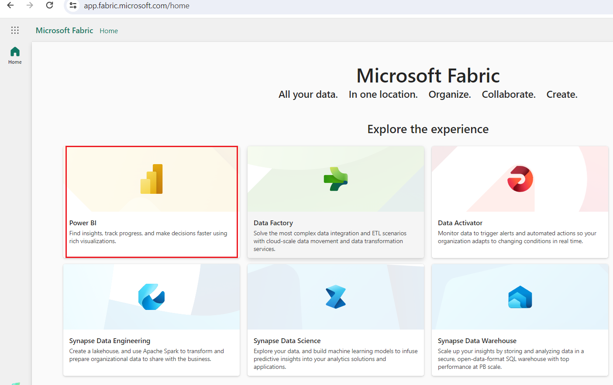

6.  In the **Power BI Home** page menu bar on the left,
    select **Workspaces** (the icon looks similar to 🗇).

      

7.  In the Workspaces pane, select **+** **New workspace**.

      

8.  In the **Create a workspace tab**, enter the following details and
    click on the **Apply** button.

    |	       |      |
    |-------|-------|
    |Name                   |!!dp_FabricXX!! (XX can be a unique number) |
    |Advanced               |Under License mode, select Trial	|
    |Default storage format |Small dataset storage format	|

       
       
       

9.  Wait for the deployment to complete. It takes 2-3 minutes to
    complete. When your new workspace opens, it should be empty.

      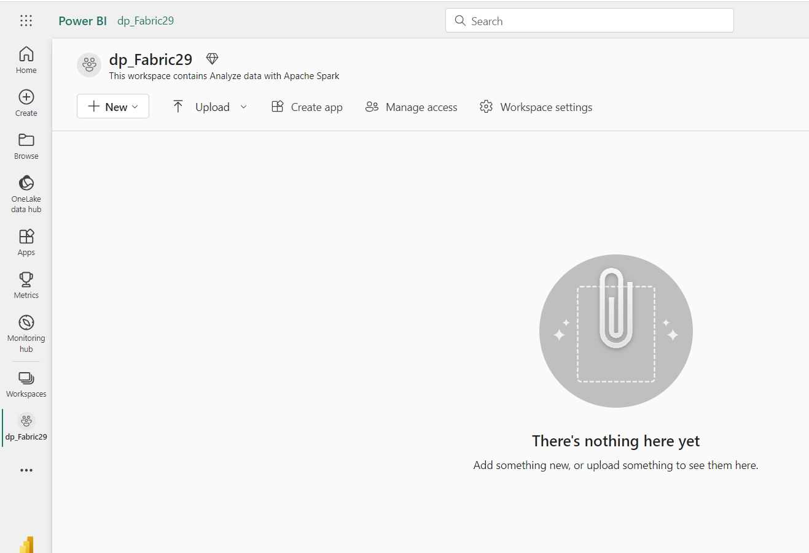

## Task 2: Create a lakehouse and upload files

Now that you have a workspace, it’s time to switch to the *Data
engineering* experience in the portal and create a data lakehouse for
the data files you’re going to analyze.

1.  At the bottom left of the Power BI portal, select the **Power
    BI** icon and switch to the **Data Engineering** experience.

      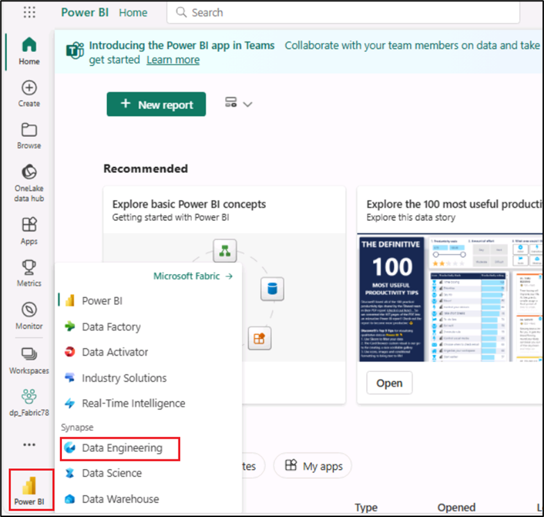

2.  In the **Synapse Data Engineering** home page, Select **Lakehouse**
    under **New** pane.

      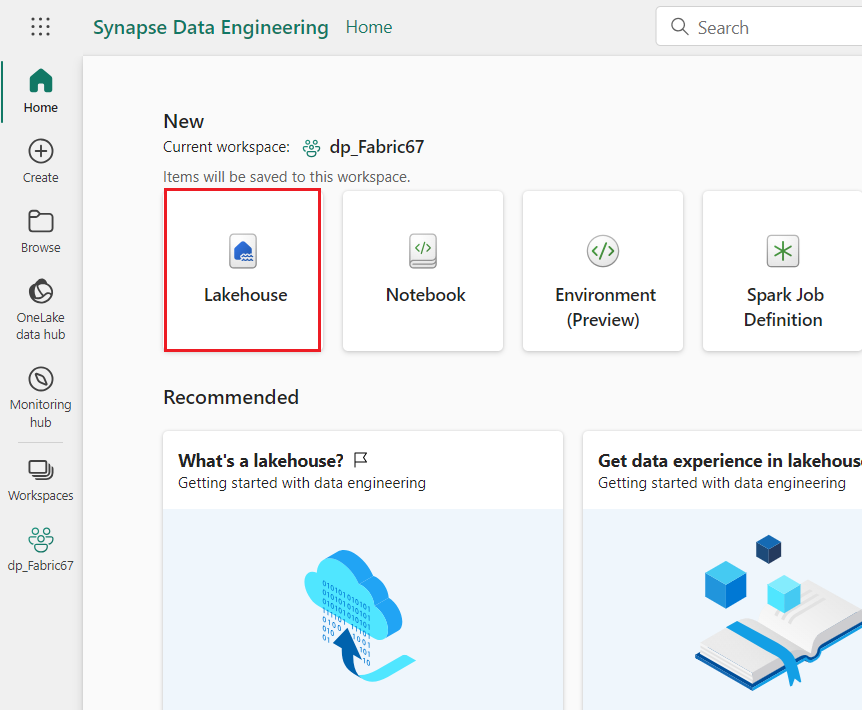

3.  In the **New lakehouse** dialog box, enter **!!Fabric_lakehouse!!** in
    the **Name** field, click on the **Create** button and open the new
    lakehouse.

      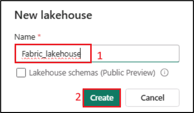

4.  After a minute or so, a new empty lakehouse will be created. You
    need to ingest some data into the data lakehouse for analysis.

      

5.  You will see a notification stating **Successfully created SQL
    endpoint**.

       

6.  In the **Explorer** section, under the **fabric_lakehouse**, hover
    your mouse beside **Files folder**, then click on the horizontal
    ellipses **(…)** menu. Navigate and click on **Upload**, then click
    on the **Upload folder** as shown in the below image.

      

7.  On the **Upload folder** pane that appears on the right side, select
    the **folder icon** under the **Files/** and then browse to
    **C:\LabFiles** and then select the **orders** folder and click on
    the **Upload** button.

      

8.  In case, the **Upload 3 files to this site?** dialog box appears,
    then click on **Upload** button.

       

9.  In the Upload folder pane, click on the **Upload** button.

      

10. After the files have been uploaded **close** the **Upload folder**
    pane.

      

11. Expand **Files** and select the **orders** folder and verify that
    the CSV files have been uploaded.

     

## Task 3: Create a notebook

To work with data in Apache Spark, you can create a *notebook*.
Notebooks provide an interactive environment in which you can write and
run code (in multiple languages), and add notes to document it.

1.  On the **Home** page while viewing the contents of
    the **orders** folder in your datalake, in the **Open
    notebook** menu, select **New notebook**.

     

2.  After a few seconds, a new notebook containing a single **cell** will
    open. Notebooks are made up of one or more cells that can
    contain **code** or **markdown** (formatted text).

      

3.  Select the first cell (which is currently a *code* cell), and then
    in the dynamic tool bar at its top-right, use the **M↓** button to
    **convert the cell to a markdown cell**.

      

4.  When the cell changes to a markdown cell, the text it contains is
    rendered.

      

5.  Use the **🖉** (Edit) button to switch the cell to editing mode,
    replace all the text then modify the markdown as follows:
    
     CodeCopy
    
    ```
    # Sales order data exploration
    
    Use the code in this notebook to explore sales order data.
    ```
      
      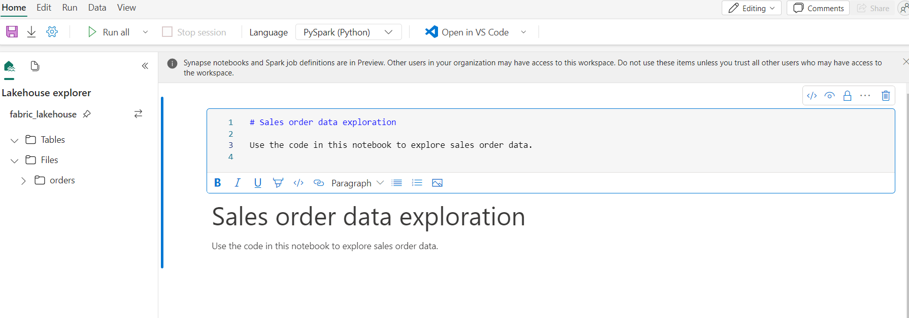

7.  Click anywhere in the notebook outside of the cell to stop editing
    it and see the rendered markdown.

      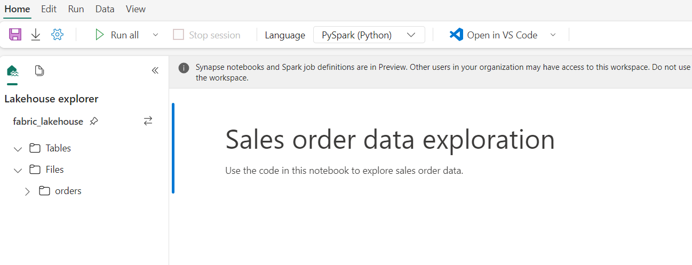

## Task 4: Load data into a dataframe

Now you’re ready to run code that loads the data into a *dataframe*.
Dataframes in Spark are similar to Pandas dataframes in Python, and
provide a common structure for working with data in rows and columns.

**Note**: Spark supports multiple coding languages, including Scala,
Java, and others. In this exercise, we’ll use *PySpark*, which is a
Spark-optimized variant of Python. PySpark is one of the most commonly
used languages on Spark and is the default language in Fabric notebooks.

1.  With the notebook visible, expand the **Files** list and select
    the **orders** folder so that the CSV files are listed next to the
    notebook editor.

      

2.  Now, however your mouse to 2019.csv file. Click on the horizontal
    ellipses **(…)** beside 2019.csv. Navigate and click on **Load
    data**, then select **Spark**. A new code cell containing the
    following code will be added to the notebook:

    CodeCopy
    ```
    df = spark.read.format("csv").option("header","true").load("Files/orders/2019.csv")
    # df now is a Spark DataFrame containing CSV data from "Files/orders/2019.csv".
    display(df)
    ```
     
      

    **Tip**: You can hide the Lakehouse explorer panes on the left by using
    their **«** icons. Doing

    so will help you focus on the notebook.

3.  Use the **▷ Run cell** button on the left of the cell to run it.

      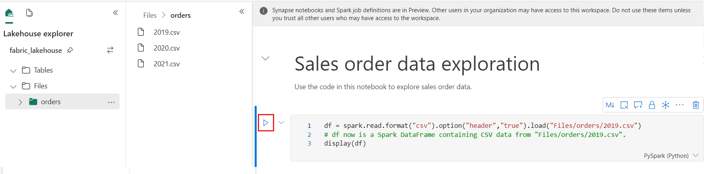

    **Note**: Since this is the first time you’ve run any Spark code, a
    Spark session must be started. This means that the first run in the
    session can take a minute or so to complete. Subsequent runs will be
    quicker.

4.  When the cell command has completed, review the output below the
    cell, which should look similar to this:

      

5.  The output shows the rows and columns of data from the 2019.csv
    file. However, note that the column headers don’t look right. The
    default code used to load the data into a dataframe assumes that the
    CSV file includes the column names in the first row, but in this
    case the CSV file just includes the data with no header information.

6.  Modify the code to set the **header** option to **false**. Replace
    all the code in the **cell** with the following code and click on
    **▷ Run cell** button and review the output
    ```
    df = spark.read.format("csv").option("header","true").load("Files/orders/2019.csv")
    # df now is a Spark DataFrame containing CSV data from "Files/orders/2019.csv".
    display(df)
    ```
    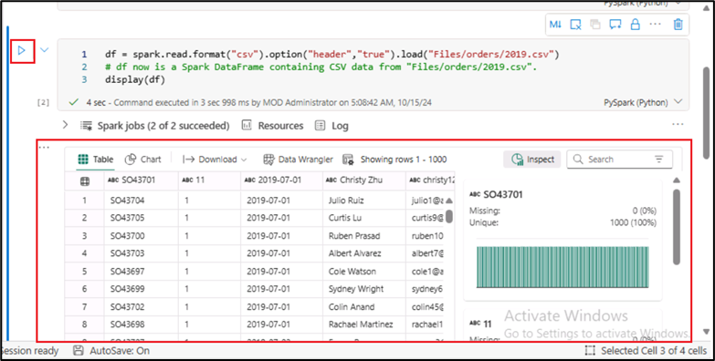

7.  Now the dataframe correctly includes first row as data values, but
    the column names are auto-generated and not very helpful. To make
    sense of the data, you need to explicitly define the correct schema
    and data type for the data values in the file.

8.  Replace all the code in the **cell** with the following code and
    click on **▷ Run cell** button and review the output
    ```
    from pyspark.sql.types import *
    
    orderSchema = StructType([
        StructField("SalesOrderNumber", StringType()),
        StructField("SalesOrderLineNumber", IntegerType()),
        StructField("OrderDate", DateType()),
        StructField("CustomerName", StringType()),
        StructField("Email", StringType()),
        StructField("Item", StringType()),
        StructField("Quantity", IntegerType()),
        StructField("UnitPrice", FloatType()),
        StructField("Tax", FloatType())
        ])
    
    df = spark.read.format("csv").schema(orderSchema).load("Files/orders/2019.csv")
    display(df)
    ```
     
     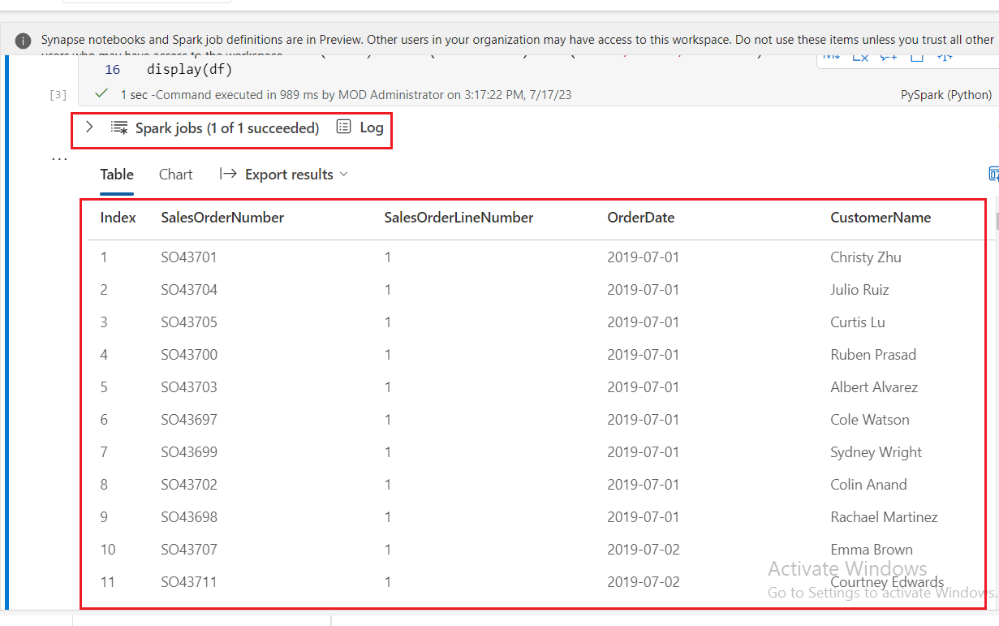

9.  Now the dataframe includes the correct column names (in addition to
    the **Index**, which is a built-in column in all dataframes based on
    the ordinal position of each row). The data types of the columns are
    specified using a standard set of types defined in the Spark SQL
    library, which were imported at the beginning of the cell.

10. Confirm that your changes have been applied to the data by viewing
    the dataframe.

11. Use the **+ Code** icon below the cell output to add a new code cell
    to the notebook, and enter the following code in it. Click on **▷
    Run cell** button and review the output
    
    ```
     display(df)
    ```
    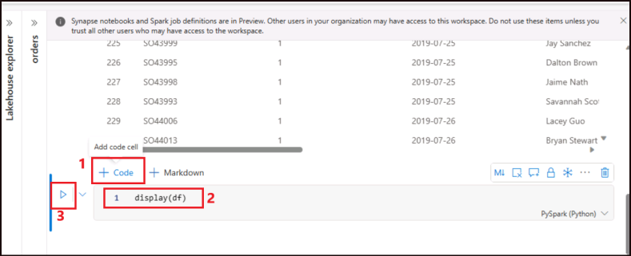
13. The dataframe includes only the data from the **2019.csv** file.
    Modify the code so that the file path uses a \* wildcard to read the
    sales order data from all of the files in the **orders** folder

14. Use the **+ Code** icon below the cell output to add a new code cell
    to the notebook, and enter the following code in it.

    CodeCopy
    
    ```
    from pyspark.sql.types import *
    
    orderSchema = StructType([
        StructField("SalesOrderNumber", StringType()),
        StructField("SalesOrderLineNumber", IntegerType()),
        StructField("OrderDate", DateType()),
        StructField("CustomerName", StringType()),
        StructField("Email", StringType()),
        StructField("Item", StringType()),
        StructField("Quantity", IntegerType()),
        StructField("UnitPrice", FloatType()),
        StructField("Tax", FloatType())
        ])
    
    df = spark.read.format("csv").schema(orderSchema).load("Files/orders/*.csv")
    display(df)
    ```
     

15. Run the modified code cell and review the output, which should now
    include sales for 2019, 2020, and 2021.

     

    **Note**: Only a subset of the rows is displayed, so you may not be able
    to see examples from all years.

# Exercise 2: Explore data in a dataframe

The dataframe object includes a wide range of functions that you can use
to filter, group, and otherwise manipulate the data it contains.

## Task 1: Filter a dataframe

1.  Use the **+ Code** icon below the cell output to add a new code cell
    to the notebook, and enter the following code in it.

    **CodeCopy**
    ```
    customers = df['CustomerName', 'Email']
    print(customers.count())
    print(customers.distinct().count())
    display(customers.distinct())
     ```
     

2.  **Run** the new code cell, and review the results. Observe the
    following details:

    - When you perform an operation on a dataframe, the result is a new
      dataframe (in this case, a new **customers** dataframe is created
      by selecting a specific subset of columns from
      the **df** dataframe)

    - Dataframes provide functions such
      as **count** and **distinct** that can be used to summarize and
      filter the data they contain.

    - The dataframe\['Field1', 'Field2', ...\] syntax is a shorthand way
      of defining a subset of columns. You can also
      use **select** method, so the first line of the code above could
      be written as customers = df.select("CustomerName", "Email")

      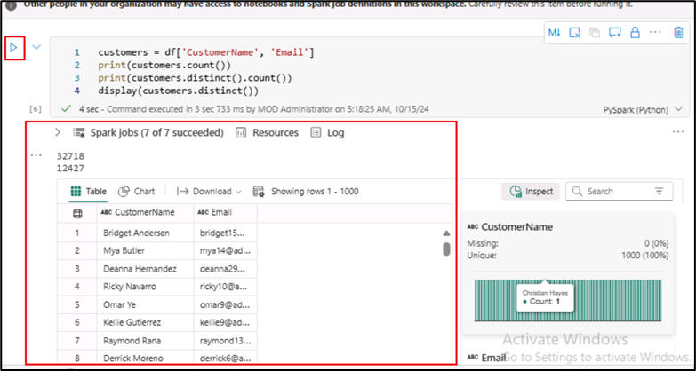

3.  Modify the code, replace all the code in the **cell** with the
    following code and click on **▷ Run cell** button as follows:
    ```
    customers = df.select("CustomerName", "Email").where(df['Item']=='Road-250 Red, 52')
    print(customers.count())
    print(customers.distinct().count())
    display(customers.distinct())
    ```

4.  **Run** the modified code to view the customers who have purchased
    the ***Road-250 Red, 52* product**. Note that you can “**chain**”
    multiple functions together so that the output of one function
    becomes the input for the next - in this case, the dataframe created
    by the **select** method is the source dataframe for
    the **where** method that is used to apply filtering criteria.

     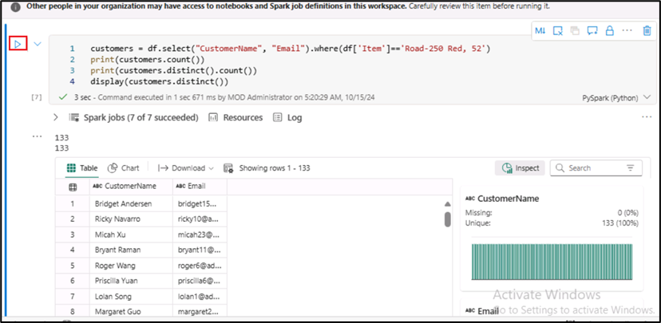

## Task 2: Aggregate and group data in a dataframe

1.  Click on **+ Code** and copy and paste the below code and then click
    on **Run cell** button.
    ```
    productSales = df.select("Item", "Quantity").groupBy("Item").sum()
    display(productSales)
    ```
   

2.  Note that the results show the sum of order quantities grouped by
    product. The **groupBy** method groups the rows by **Item**, and the
    subsequent **sum** aggregate function is applied to all of the
    remaining numeric columns (in this case, **Quantity**)

      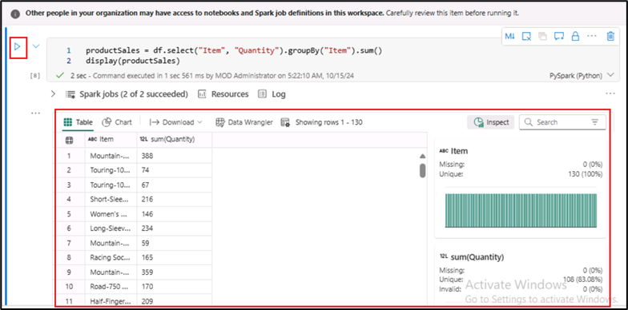

3.  Click on **+ Code** and copy and paste the below code and then click
    on **Run cell** button.
    ```
    from pyspark.sql.functions import *
    
    yearlySales = df.select(year("OrderDate").alias("Year")).groupBy("Year").count().orderBy("Year")
    display(yearlySales)
    ```
    

4.  Note that the results show the number of sales orders per year. Note
    that the **select** method includes a SQL **year** function to
    extract the year component of the *OrderDate* field (which is why
    the code includes an **import** statement to import functions from
    the Spark SQL library). It then uses an **alias** method is used to
    assign a column name to the extracted year value. The data is then
    grouped by the derived *Year* column and the count of rows in each
    group is calculated before finally the **orderBy** method is used to
    sort the resulting dataframe.

     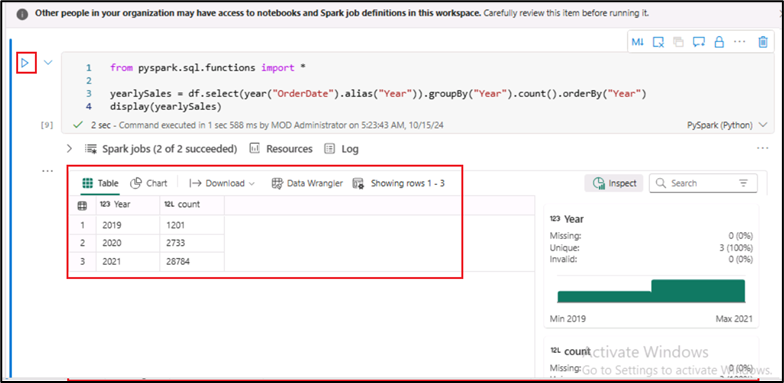

# Exercise 3: Use Spark to transform data files

A common task for data engineers is to ingest data in a particular
format or structure, and transform it for further downstream processing
or analysis.

## Task 1: Use dataframe methods and functions to transform data

1.  Click on + Code and copy and paste the below code

      **CodeCopy**
    
    ```    
    from pyspark.sql.functions import *
    
    ## Create Year and Month columns
    transformed_df = df.withColumn("Year", year(col("OrderDate"))).withColumn("Month", month(col("OrderDate")))
    
    # Create the new FirstName and LastName fields
    transformed_df = transformed_df.withColumn("FirstName", split(col("CustomerName"), " ").getItem(0)).withColumn("LastName", split(col("CustomerName"),
    " ").getItem(1))
    
    # Filter and reorder columns
    transformed_df = transformed_df["SalesOrderNumber", "SalesOrderLineNumber", "OrderDate", "Year", "Month", "FirstName", "LastName", "Email", "Item", 
    "Quantity", "UnitPrice", "Tax"]
    
    # Display the first five orders
    display(transformed_df.limit(5))
    ```
      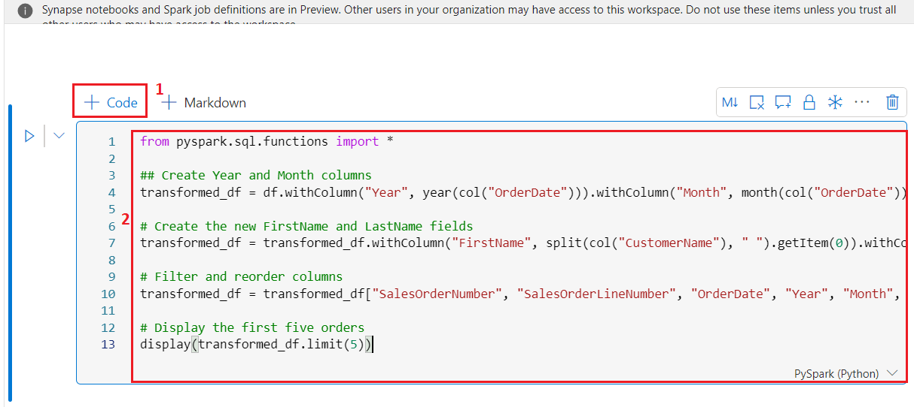

2.  **Run** the code to create a new dataframe from the original order
    data with the following transformations:

    - Add **Year** and **Month** columns based on
      the **OrderDate** column.

    - Add **FirstName** and **LastName** columns based on
      the **CustomerName** column.

    - Filter and reorder the columns, removing
      the **CustomerName** column.

     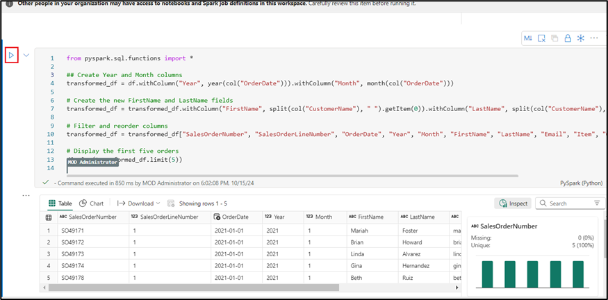

3.  Review the output and verify that the transformations have been made
    to the data.

     

    You can use the full power of the Spark SQL library to transform the
    data by filtering rows, deriving, removing, renaming columns, and
    applying any other required data modifications.

    **Tip**: See the [*Spark dataframe
    documentation*](https://spark.apache.org/docs/latest/api/python/reference/pyspark.sql/dataframe.html) to
    learn more about the methods of the Dataframe object.

## Task 2: Save the transformed data

1.  **Add a new cell** with the following code to save the transformed
    dataframe in Parquet format (Overwriting the data if it already
    exists). **Run** the cell and wait for the message that the data has
    been saved.
    
    ```
    transformed_df.write.mode("overwrite").parquet('Files/transformed_data/orders')
    print ("Transformed data saved!")
    ```

    **Note**: Commonly, *Parquet* format is preferred for data files that
     you will use for further analysis or ingestion into an analytical
     store. Parquet is a very efficient format that is supported by most
     large scale data analytics systems. In fact, sometimes your data
     transformation requirement may simply be to convert data from another
     format (such as CSV) to Parquet!
      
      

2.  Then, in the **Lakehouse explorer** pane on the left, in
    the **…** menu for the **Files** node, select **Refresh**.

     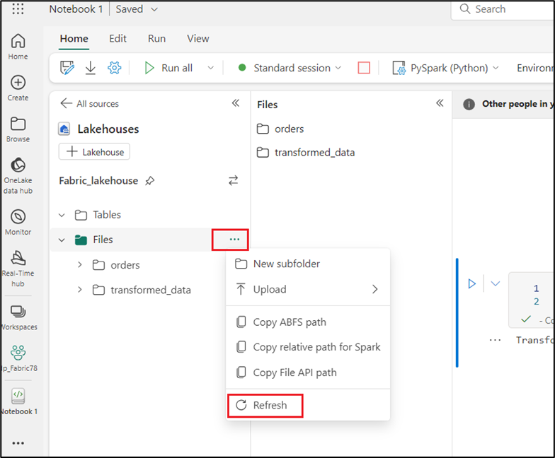

3.  Click on the **transformed_data** folder to verify that it contains
    a new folder named **orders**, which in turn contains one or more
    **Parquet files**.

     

4.  Click on **+ Code** following code to load a new dataframe from the
    parquet files in the **transformed_data -\> orders** folder:
    ```
    orders_df = spark.read.format("parquet").load("Files/transformed_data/orders")
    display(orders_df)
    ```
    

5.  **Run** the cell and verify that the results show the order data
    that has been loaded from the parquet files.

     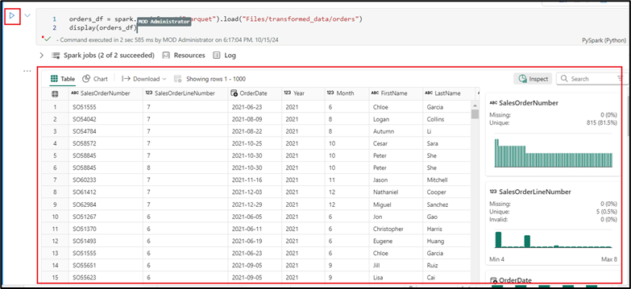

## Task 3: Save data in partitioned files

1.  Add a new cell, Click on **+ Code** with the following code; which
    saves the dataframe, partitioning the data
    by **Year** and **Month**. **Run** the cell and wait for the message
    that the data has been saved
    ```
    orders_df.write.partitionBy("Year","Month").mode("overwrite").parquet("Files/partitioned_data")
    print ("Transformed data saved!")
    ```
      
       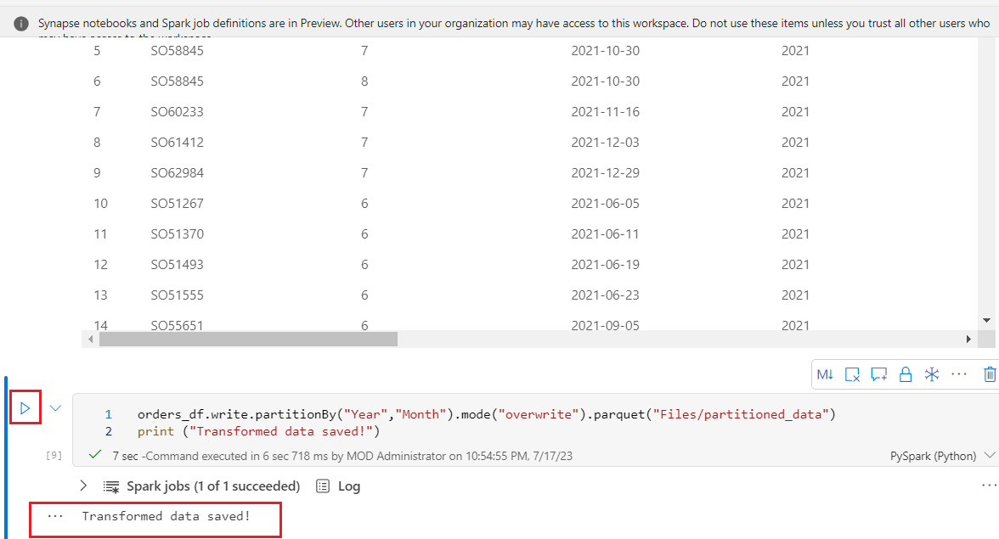

2.  Then, in the **Lakehouse explorer** pane on the left, in
    the **…** menu for the **Files** node, select **Refresh.**

      

      

3.  Expand the **partitioned_orders** folder to verify that it contains
    a hierarchy of folders named **Year=*xxxx***, each containing
    folders named **Month=*xxxx***. Each month folder contains a parquet
    file with the orders for that month.

      

      

> Partitioning data files is a common way to optimize performance when
> dealing with large volumes of data. This technique can significant
> improve performance and make it easier to filter data.

4.  Add a new cell, click on **+ Code** with the following code to load
    a new dataframe from the **orders.parquet** file:
    ```
    orders_2021_df = spark.read.format("parquet").load("Files/partitioned_data/Year=2021/Month=*")
    display(orders_2021_df)
    ```
     

5.  **Run** the cell and verify that the results show the order data for
    sales in 2021. Note that the partitioning columns specified in the
    path (**Year** and **Month**) are not included in the dataframe.

     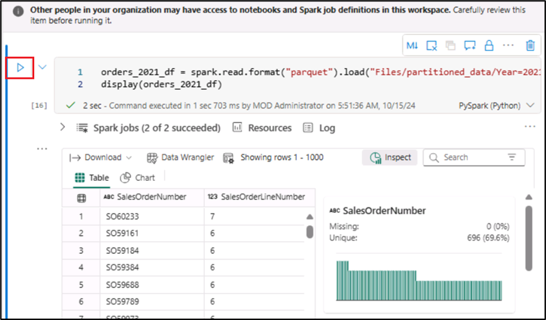


**Summary**

This lab guides you through the process of working with Microsoft
Fabric within Power BI. It covers various tasks, including setting up a
workspace, creating a lakehouse, uploading and managing data files, and
using notebooks for data exploration. Participants will learn how to
manipulate and transform data using PySpark, create visualizations, and
save and partition data for efficient querying.

